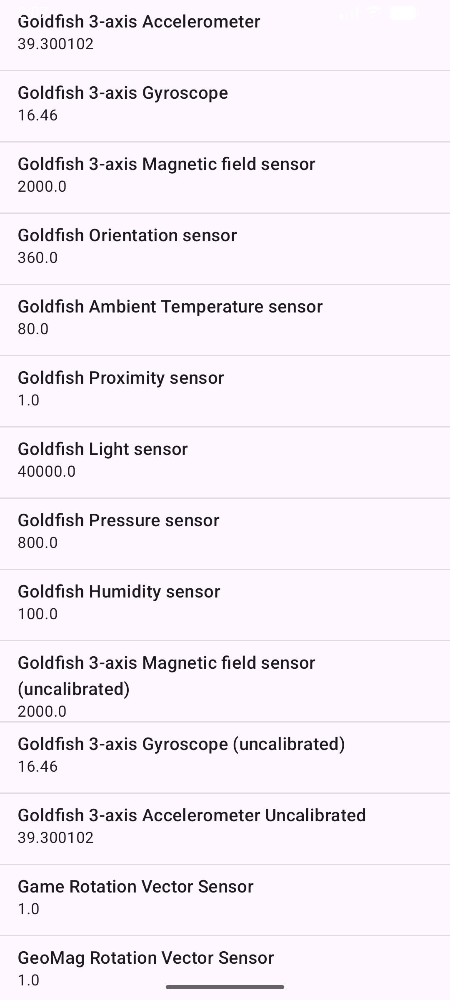
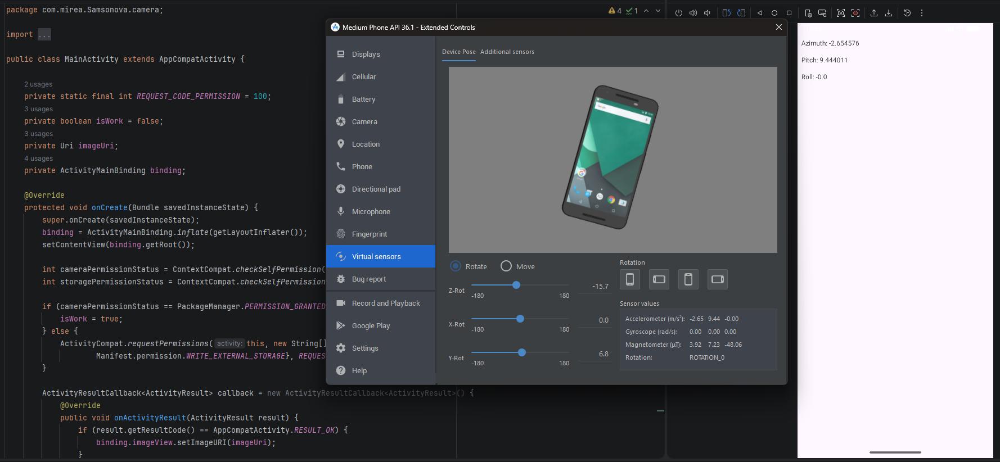
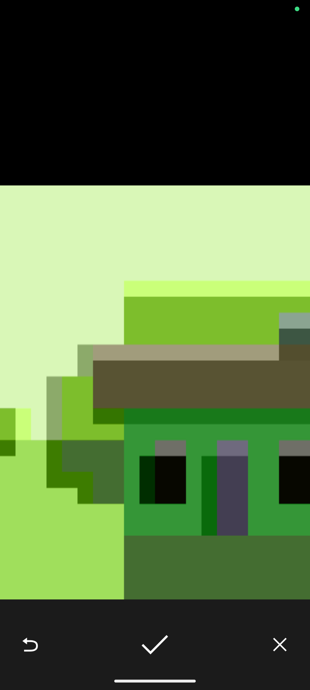
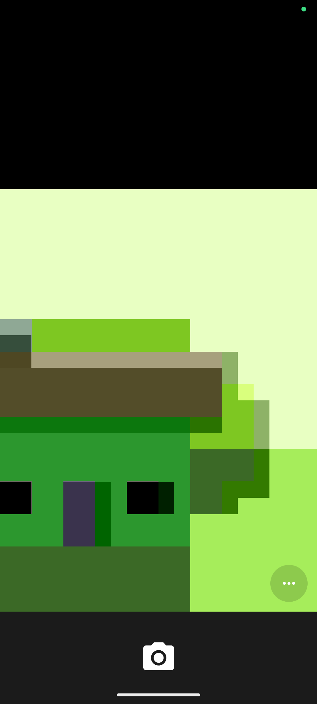
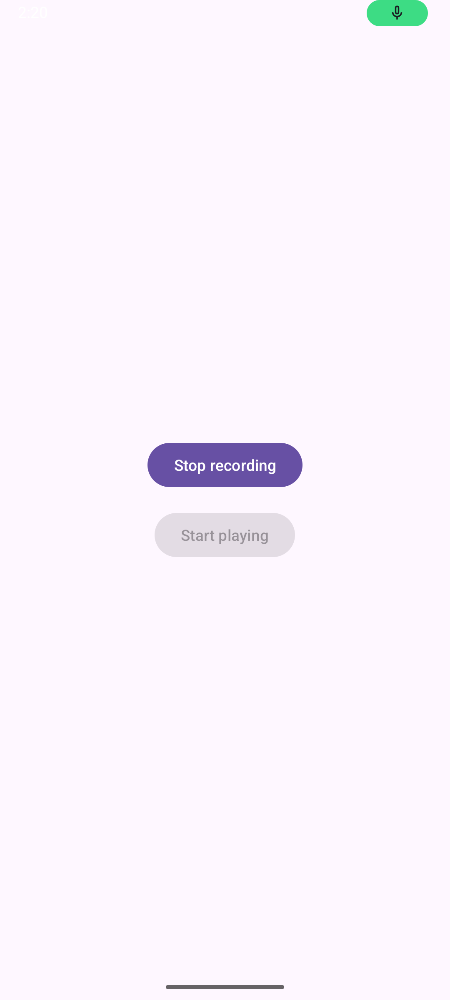
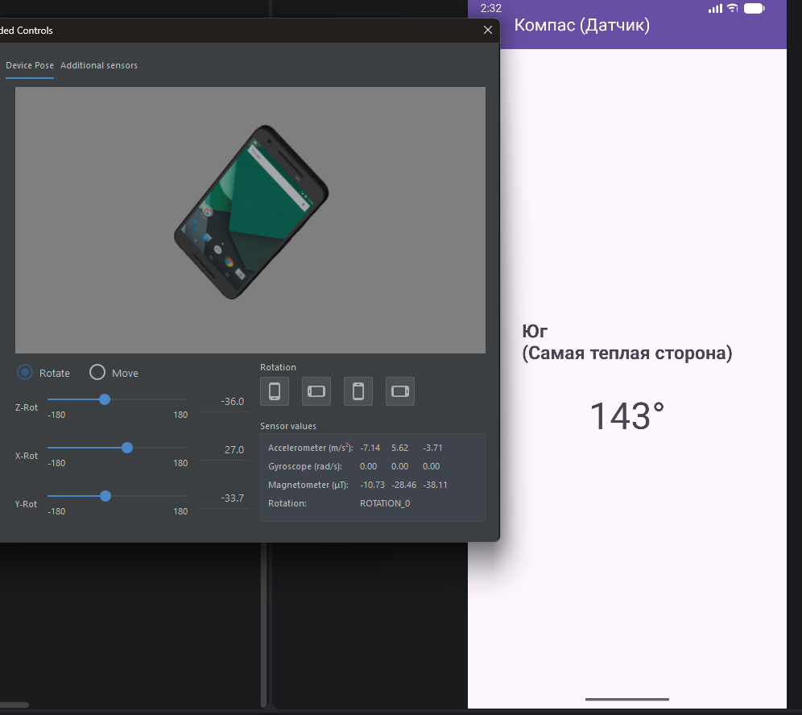
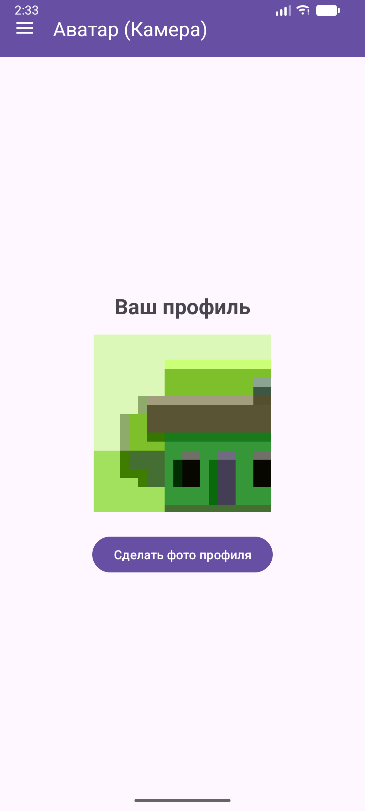
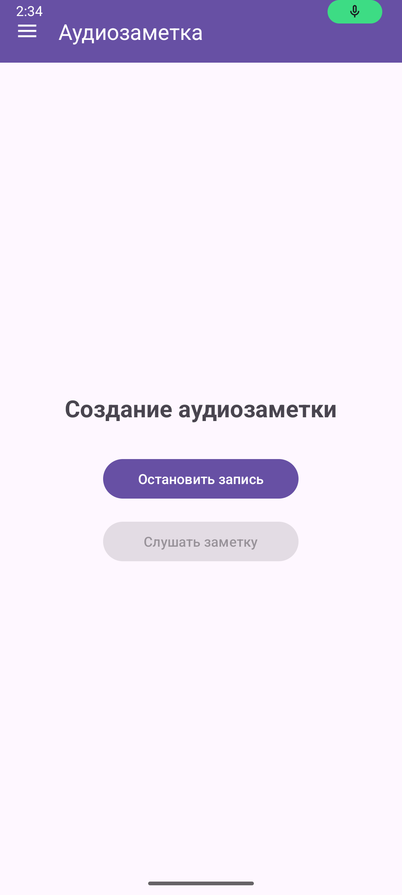

# Отчет по практической работе №5

**Выполнил:** Студент группы БСБО-09-23 **ФИО:** Самсонова Ольга Павловна **Дисциплина:** Разработка мобильных приложений

---

## 1. Цель работы

Целью данной работы является изучение возможностей операционной системы Android по работе с аппаратными компонентами мобильного устройства. В ходе выполнения работы необходимо освоить механизмы взаимодействия с датчиками устройства (через `SensorManager`), научиться работать с системными мультимедийными приложениями (вызов камеры через `MediaStore`), а также изучить программную запись и воспроизведение аудио (с использованием классов `MediaRecorder` и `MediaPlayer`). Важнейшей частью работы является освоение современной модели запроса разрешений (Runtime Permissions) во время выполнения приложения с использованием API `ActivityResultContracts`, а также обеспечение безопасного доступа к файлам через `FileProvider`. Итоговой задачей является интеграция изученных аппаратных возможностей в комплексный проект `MireaProject`.

---

## 2. Архитектура проекта

Проект разделен на отдельные модули, каждый из которых демонстрирует работу с конкретной аппаратной подсистемой:

1. **app (Lesson5)** — базовый модуль. Предназначен для получения и отображения полного списка всех доступных аппаратных и виртуальных датчиков на устройстве.
2. **Accelerometer** — модуль для работы с датчиком пространственного положения. Демонстрирует получение данных в реальном времени (ускорение по осям X, Y, Z).
3. **Camera** — модуль для работы с системным приложением камеры. Включает в себя генерацию безопасных URI через `FileProvider`, запрос разрешений и сохранение полноразмерных изображений в память устройства.
4. **AudioRecord** — модуль диктофона. Демонстрирует управление состояниями записи и воспроизведения звука с помощью конечных автоматов `MediaRecorder` и `MediaPlayer`.
5. **MireaProject** — итоговый проект с архитектурой **Navigation Drawer**. Включает реализацию контрольного задания: компас (определение сторон света на основе акселерометра и магнитометра), создание аватара профиля (камера) и запись аудиозаметок (микрофон).

---

## 3. Ход работы

### 3.1. Модуль app (Lesson5) — Работа со списком датчиков

На первом этапе был создан модуль для вывода списка всех датчиков устройства. Для доступа к датчиковой аппаратуре использовался системный сервис `Context.SENSOR_SERVICE`, который возвращает объект `SensorManager`. С помощью метода `getSensorList(Sensor.TYPE_ALL)` был получен массив всех поддерживаемых датчиков (как аппаратных, так и виртуальных). 

Для отображения данных на экране (названия датчика и его максимального диапазона) использовался компонент `ListView` и стандартный адаптер `SimpleAdapter`, связывающий данные из `ArrayList<HashMap>` с разметкой `simple_list_item_2`.

**Рисунок 1: Главный экран приложения со списком доступных датчиков.**


**Листинг** `MainActivity.java`:

```java
package com.mirea.Samsonova.lesson5;

import android.content.Context;
import android.hardware.Sensor;
import android.hardware.SensorManager;
import android.os.Bundle;
import android.widget.ListView;
import android.widget.SimpleAdapter;

import androidx.appcompat.app.AppCompatActivity;

import java.util.ArrayList;
import java.util.HashMap;
import java.util.List;

import com.mirea.Samsonova.lesson5.databinding.ActivityMainBinding;

public class MainActivity extends AppCompatActivity {

    private ActivityMainBinding binding;

    @Override
    protected void onCreate(Bundle savedInstanceState) {
        super.onCreate(savedInstanceState);
        binding = ActivityMainBinding.inflate(getLayoutInflater());
        setContentView(binding.getRoot());

        SensorManager sensorManager = (SensorManager) getSystemService(Context.SENSOR_SERVICE);
        List<Sensor> sensors = sensorManager.getSensorList(Sensor.TYPE_ALL);
        ListView listSensor = binding.listView; // в методичке написано sensorListView, но в xml id=list_view

        ArrayList<HashMap<String, Object>> arrayList = new ArrayList<>();
        for (int i = 0; i < sensors.size(); i++) {
            HashMap<String, Object> sensorTypeList = new HashMap<>();
            sensorTypeList.put("Name", sensors.get(i).getName());
            sensorTypeList.put("Value", sensors.get(i).getMaximumRange());
            arrayList.add(sensorTypeList);
        }

        SimpleAdapter mHistory = new SimpleAdapter(this, arrayList, android.R.layout.simple_list_item_2,
                new String[]{"Name", "Value"},
                new int[]{android.R.id.text1, android.R.id.text2});

        listSensor.setAdapter(mHistory);
    }
}
```

**Листинг** `activity_main.xml`:

```xml
<?xml version="1.0" encoding="utf-8"?>
<androidx.constraintlayout.widget.ConstraintLayout
    xmlns:android="http://schemas.android.com/apk/res/android"
    xmlns:app="http://schemas.android.com/apk/res-auto"
    xmlns:tools="http://schemas.android.com/tools"
    android:layout_width="match_parent"
    android:layout_height="match_parent"
    tools:context=".MainActivity">

    <ListView
        android:id="@+id/list_view"
        android:layout_width="wrap_content"
        android:layout_height="wrap_content"
        android:layout_marginStart="8dp"
        android:layout_marginTop="8dp"
        android:layout_marginEnd="8dp"
        android:layout_marginBottom="8dp"
        app:layout_constraintBottom_toBottomOf="parent"
        app:layout_constraintEnd_toEndOf="parent"
        app:layout_constraintStart_toStartOf="parent"
        app:layout_constraintTop_toTopOf="parent" />

</androidx.constraintlayout.widget.ConstraintLayout>
```

---

### 3.2. Модуль Accelerometer — Получение показаний акселерометра

В данном модуле была реализована работа с акселерометром для определения положения телефона в пространстве. Класс `MainActivity` реализует интерфейс `SensorEventListener`, что обязывает переопределить методы `onSensorChanged` и `onAccuracyChanged`.

Регистрация слушателя датчика происходит в методе жизненного цикла `onResume()`, а отписка (для экономии заряда батареи) — в методе `onPause()`. В методе `onSensorChanged` извлекается массив `event.values`, содержащий ускорение по осям X (боковое), Y (продольное) и Z (вертикальное), после чего значения выводятся в `TextView`.

**Рисунок 2: Отображение значений акселерометра в реальном времени (с использованием эмулятора).**


**Листинг** `MainActivity.java`:

```java
package com.mirea.Samsonova.accelerometer;

import android.content.Context;
import android.hardware.Sensor;
import android.hardware.SensorEvent;
import android.hardware.SensorEventListener;
import android.hardware.SensorManager;
import android.os.Bundle;
import android.widget.TextView;

import androidx.appcompat.app.AppCompatActivity;

public class MainActivity extends AppCompatActivity implements SensorEventListener {

    private TextView azimuthTextView;
    private TextView pitchTextView;
    private TextView rollTextView;
    private SensorManager sensorManager;
    private Sensor accelerometerSensor;

    @Override
    protected void onCreate(Bundle savedInstanceState) {
        super.onCreate(savedInstanceState);
        setContentView(com.mirea.Samsonova.accelerometer.R.layout.activity_main);

        sensorManager = (SensorManager) getSystemService(Context.SENSOR_SERVICE);
        accelerometerSensor = sensorManager.getDefaultSensor(Sensor.TYPE_ACCELEROMETER);

        azimuthTextView = findViewById(R.id.textViewAzimuth);
        pitchTextView = findViewById(R.id.textViewPitch);
        rollTextView = findViewById(R.id.textViewRoll);
    }

    @Override
    protected void onPause() {
        super.onPause();
        sensorManager.unregisterListener(this);
    }

    @Override
    protected void onResume() {
        super.onResume();
        sensorManager.registerListener(this, accelerometerSensor, SensorManager.SENSOR_DELAY_NORMAL);
    }

    @Override
    public void onSensorChanged(SensorEvent event) {
        if (event.sensor.getType() == Sensor.TYPE_ACCELEROMETER) {
            float valueAzimuth = event.values[0];
            float valuePitch = event.values[1];
            float valueRoll = event.values[2];

            azimuthTextView.setText("Azimuth: " + valueAzimuth);
            pitchTextView.setText("Pitch: " + valuePitch);
            rollTextView.setText("Roll: " + valueRoll);
        }
    }

    @Override
    public void onAccuracyChanged(Sensor sensor, int accuracy) {
    }
}
```

**Листинг** `activity_main.xml`:

```java
<?xml version="1.0" encoding="utf-8"?>
<androidx.constraintlayout.widget.ConstraintLayout
    xmlns:android="http://schemas.android.com/apk/res/android"
    xmlns:app="http://schemas.android.com/apk/res-auto"
    xmlns:tools="http://schemas.android.com/tools"
    android:layout_width="match_parent"
    android:layout_height="match_parent"
    tools:context=".MainActivity">

    <TextView
        android:id="@+id/textViewAzimuth"
        android:layout_width="match_parent"
        android:layout_height="wrap_content"
        android:layout_marginStart="8dp"
        android:layout_marginTop="32dp"
        android:layout_marginEnd="8dp"
        app:layout_constraintEnd_toEndOf="parent"
        app:layout_constraintStart_toStartOf="parent"
        app:layout_constraintTop_toTopOf="parent" />

    <TextView
        android:id="@+id/textViewPitch"
        android:layout_width="match_parent"
        android:layout_height="wrap_content"
        android:layout_marginStart="8dp"
        android:layout_marginTop="16dp"
        android:layout_marginEnd="8dp"
        app:layout_constraintEnd_toEndOf="parent"
        app:layout_constraintStart_toStartOf="parent"
        app:layout_constraintTop_toBottomOf="@+id/textViewAzimuth" />

    <TextView
        android:id="@+id/textViewRoll"
        android:layout_width="match_parent"
        android:layout_height="wrap_content"
        android:layout_marginStart="8dp"
        android:layout_marginTop="16dp"
        android:layout_marginEnd="8dp"
        app:layout_constraintEnd_toEndOf="parent"
        app:layout_constraintStart_toStartOf="parent"
        app:layout_constraintTop_toBottomOf="@+id/textViewPitch" />

</androidx.constraintlayout.widget.ConstraintLayout>
```

---

### 3.3. Модуль Camera — Работа с системной камерой и FileProvider

В модуле камеры реализован безопасный вызов системного приложения для создания фотографии. В новых версиях Android прямая передача путей к файлам (`file://`) запрещена, поэтому был настроен `FileProvider`, инкапсулирующий данные и предоставляющий их через `content://` URI.

Перед открытием камеры выполняется запрос разрешения `Manifest.permission.CAMERA` во время выполнения (Runtime Permission). Был создан метод `createImageFile()`, генерирующий уникальное имя файла на основе текущего времени. Для обработки результата (получения фото) использовался современный подход `ActivityResultLauncher`.

**Рисунок 3: Окно камеры.**

**Рисунок 4: Отображение сделанной фотографии.**


**Листинг** `AndroidManifest.xml` (модуль Camera):

```xml
<?xml version="1.0" encoding="utf-8"?>
<manifest xmlns:android="http://schemas.android.com/apk/res/android">

    <uses-permission android:name="android.permission.CAMERA" />
    <uses-permission android:name="android.permission.WRITE_EXTERNAL_STORAGE" />

    <application
        android:allowBackup="true"
        android:icon="@mipmap/ic_launcher"
        android:label="@string/app_name"
        android:roundIcon="@mipmap/ic_launcher_round"
        android:supportsRtl="true"
        android:theme="@style/Theme.Lesson5">
        <activity
            android:name=".MainActivity"
            android:exported="true">
            <intent-filter>
                <action android:name="android.intent.action.MAIN" />

                <category android:name="android.intent.category.LAUNCHER" />
            </intent-filter>
        </activity>

        <provider
            android:name="androidx.core.content.FileProvider"
            android:authorities="com.mirea.Samsonova.camera.fileprovider"
            android:exported="false"
            android:grantUriPermissions="true">
            <meta-data
                android:name="android.support.FILE_PROVIDER_PATHS"
                android:resource="@xml/paths" />
        </provider>
    </application>

</manifest>
```

**Листинг** `paths.xml` (res/xml):

```xml
<?xml version="1.0" encoding="utf-8"?>
<paths>
    <external-files-path name="images" path="Pictures" />
</paths>
```

**Листинг** `MainActivity.java`:

```java
package com.mirea.Samsonova.camera;

import android.Manifest;
import android.content.Intent;
import android.content.pm.PackageManager;
import android.net.Uri;
import android.os.Bundle;
import android.os.Environment;
import android.provider.MediaStore;
import android.view.View;

import androidx.activity.result.ActivityResult;
import androidx.activity.result.ActivityResultCallback;
import androidx.activity.result.ActivityResultLauncher;
import androidx.activity.result.contract.ActivityResultContracts;
import androidx.annotation.NonNull;
import androidx.appcompat.app.AppCompatActivity;
import androidx.core.app.ActivityCompat;
import androidx.core.content.ContextCompat;
import androidx.core.content.FileProvider;

import java.io.File;
import java.io.IOException;
import java.text.SimpleDateFormat;
import java.util.Date;
import java.util.Locale;

import com.mirea.Samsonova.camera.databinding.ActivityMainBinding;

public class MainActivity extends AppCompatActivity {

    private static final int REQUEST_CODE_PERMISSION = 100;
    private boolean isWork = false;
    private Uri imageUri;
    private ActivityMainBinding binding;

    @Override
    protected void onCreate(Bundle savedInstanceState) {
        super.onCreate(savedInstanceState);
        binding = ActivityMainBinding.inflate(getLayoutInflater());
        setContentView(binding.getRoot());

        int cameraPermissionStatus = ContextCompat.checkSelfPermission(this, Manifest.permission.CAMERA);
        int storagePermissionStatus = ContextCompat.checkSelfPermission(this, Manifest.permission.WRITE_EXTERNAL_STORAGE);

        if (cameraPermissionStatus == PackageManager.PERMISSION_GRANTED && storagePermissionStatus == PackageManager.PERMISSION_GRANTED) {
            isWork = true;
        } else {
            ActivityCompat.requestPermissions(this, new String[]{Manifest.permission.CAMERA,
                    Manifest.permission.WRITE_EXTERNAL_STORAGE}, REQUEST_CODE_PERMISSION);
        }

        ActivityResultCallback<ActivityResult> callback = new ActivityResultCallback<ActivityResult>() {
            @Override
            public void onActivityResult(ActivityResult result) {
                if (result.getResultCode() == AppCompatActivity.RESULT_OK) {
                    binding.imageView.setImageURI(imageUri);
                }
            }
        };

        ActivityResultLauncher<Intent> cameraActivityResultLauncher = registerForActivityResult(
                new ActivityResultContracts.StartActivityForResult(), callback);

        binding.imageView.setOnClickListener(new View.OnClickListener() {
            @Override
            public void onClick(View v) {
                Intent cameraIntent = new Intent(MediaStore.ACTION_IMAGE_CAPTURE);
                if (isWork) {
                    try {
                        File photoFile = createImageFile();
                        String authorities = getApplicationContext().getPackageName() + ".fileprovider";
                        imageUri = FileProvider.getUriForFile(MainActivity.this, authorities, photoFile);
                        cameraIntent.putExtra(MediaStore.EXTRA_OUTPUT, imageUri);
                        cameraActivityResultLauncher.launch(cameraIntent);
                    } catch (IOException e) {
                        e.printStackTrace();
                    }
                }
            }
        });
    }

    @Override
    public void onRequestPermissionsResult(int requestCode, @NonNull String[] permissions, @NonNull int[] grantResults) {
        super.onRequestPermissionsResult(requestCode, permissions, grantResults);
        if (requestCode == REQUEST_CODE_PERMISSION) {
            isWork = grantResults.length > 0 && grantResults[0] == PackageManager.PERMISSION_GRANTED;
        }
    }

    private File createImageFile() throws IOException {
        String timeStamp = new SimpleDateFormat("yyyyMMdd_HHmmss", Locale.ENGLISH).format(new Date());
        String imageFileName = "IMAGE_" + timeStamp + "_";
        File storageDirectory = getExternalFilesDir(Environment.DIRECTORY_PICTURES);
        return File.createTempFile(imageFileName, ".jpg", storageDirectory);
    }
}
```

**Листинг** `activity_main.xml`:

```java
<?xml version="1.0" encoding="utf-8"?>
<androidx.constraintlayout.widget.ConstraintLayout
    xmlns:android="http://schemas.android.com/apk/res/android"
    xmlns:app="http://schemas.android.com/apk/res-auto"
    android:layout_width="match_parent"
    android:layout_height="match_parent">

    <ImageView
        android:id="@+id/imageView"
        android:layout_width="match_parent"
        android:layout_height="match_parent"
        android:scaleType="centerCrop"
        android:clickable="true"
        android:focusable="true"
        android:contentDescription="Tap to take photo"
        app:layout_constraintBottom_toBottomOf="parent"
        app:layout_constraintEnd_toEndOf="parent"
        app:layout_constraintStart_toStartOf="parent"
        app:layout_constraintTop_toTopOf="parent" />

</androidx.constraintlayout.widget.ConstraintLayout>
```

---

### 3.4. Модуль AudioRecord — Запись и воспроизведение звука

Модуль диктофона демонстрирует работу с аудио-подсистемой Android. Для записи звука используется класс `MediaRecorder`, для воспроизведения — `MediaPlayer`. 

Реализована логика, предотвращающая одновременную запись и воспроизведение путем блокировки соответствующих кнопок. Перед началом записи запрашивается разрешение `RECORD_AUDIO`. Аудиофайл сохраняется во внешнее хранилище приложения в формате `3GPP` с кодеком `AMR_NB`.

**Рисунок 5: Процесс записи аудио (кнопка Play заблокирована).**

**Рисунок 6: Процесс воспроизведения аудио (кнопка Record заблокирована).**


**Листинг** `AndroidManifest.xml` (модуль AudioRecord):

```xml
<?xml version="1.0" encoding="utf-8"?>
<manifest xmlns:android="http://schemas.android.com/apk/res/android">

    <uses-permission android:name="android.permission.RECORD_AUDIO"/>
    <uses-permission android:name="android.permission.WRITE_EXTERNAL_STORAGE" />

    <application
        android:allowBackup="true"
        android:icon="@mipmap/ic_launcher"
        android:label="@string/app_name"
        android:roundIcon="@mipmap/ic_launcher_round"
        android:supportsRtl="true"
        android:theme="@style/Theme.Lesson5">
        <activity
            android:name=".MainActivity"
            android:exported="true">
            <intent-filter>
                <action android:name="android.intent.action.MAIN" />

                <category android:name="android.intent.category.LAUNCHER" />
            </intent-filter>
        </activity>
    </application>

</manifest>
```

**Листинг** `MainActivity.java`:

```java
package com.mirea.Samsonova.audiorecord;

import android.Manifest;
import android.content.pm.PackageManager;
import android.media.MediaPlayer;
import android.media.MediaRecorder;
import android.os.Bundle;
import android.os.Environment;
import android.util.Log;
import android.view.View;
import android.widget.Button;

import androidx.annotation.NonNull;
import androidx.appcompat.app.AppCompatActivity;
import androidx.core.app.ActivityCompat;
import androidx.core.content.ContextCompat;

import java.io.File;
import java.io.IOException;

import com.mirea.Samsonova.audiorecord.databinding.ActivityMainBinding;

public class MainActivity extends AppCompatActivity {

    private static final int REQUEST_CODE_PERMISSION = 200;
    private final String TAG = MainActivity.class.getSimpleName();
    private boolean isWork;
    private String recordFilePath = null;
    private Button recordButton = null;
    private Button playButton = null;
    private MediaRecorder recorder = null;
    private MediaPlayer player = null;
    boolean isStartRecording = true;
    boolean isStartPlaying = true;
    private ActivityMainBinding binding;

    @Override
    protected void onCreate(Bundle savedInstanceState) {
        super.onCreate(savedInstanceState);
        binding = ActivityMainBinding.inflate(getLayoutInflater());
        setContentView(binding.getRoot());

        recordButton = binding.recordButton;
        playButton = binding.playButton;
        playButton.setEnabled(false);
        recordFilePath = (new File(getExternalFilesDir(Environment.DIRECTORY_MUSIC),
                "/audiorecordtest.3gp")).getAbsolutePath();

        int audioRecordPermissionStatus = ContextCompat.checkSelfPermission(this, Manifest.permission.RECORD_AUDIO);
        int storagePermissionStatus = ContextCompat.checkSelfPermission(this, Manifest.permission.WRITE_EXTERNAL_STORAGE);

        if (audioRecordPermissionStatus == PackageManager.PERMISSION_GRANTED && storagePermissionStatus == PackageManager.PERMISSION_GRANTED) {
            isWork = true;
        } else {
            ActivityCompat.requestPermissions(this, new String[]{Manifest.permission.RECORD_AUDIO,
                    Manifest.permission.WRITE_EXTERNAL_STORAGE}, REQUEST_CODE_PERMISSION);
        }

        recordButton.setOnClickListener(new View.OnClickListener() {
            @Override
            public void onClick(View v) {
                if (isStartRecording) {
                    recordButton.setText("Stop recording");
                    playButton.setEnabled(false);
                    startRecording();
                } else {
                    recordButton.setText("Start recording");
                    playButton.setEnabled(true);
                    stopRecording();
                }
                isStartRecording = !isStartRecording;
            }
        });

        playButton.setOnClickListener(new View.OnClickListener() {
            @Override
            public void onClick(View v) {
                if (isStartPlaying) {
                    playButton.setText("Stop playing");
                    recordButton.setEnabled(false);
                    startPlaying();
                } else {
                    playButton.setText("Start playing");
                    recordButton.setEnabled(true);
                    stopPlaying();
                }
                isStartPlaying = !isStartPlaying;
            }
        });
    }

    @Override
    public void onRequestPermissionsResult(int requestCode, @NonNull String[] permissions, @NonNull int[] grantResults) {
        super.onRequestPermissionsResult(requestCode, permissions, grantResults);
        if (requestCode == REQUEST_CODE_PERMISSION) {
            isWork = grantResults.length > 0 && grantResults[0] == PackageManager.PERMISSION_GRANTED;
        }
        if (!isWork) finish();
    }

    private void startRecording() {
        recorder = new MediaRecorder();
        recorder.setAudioSource(MediaRecorder.AudioSource.MIC);
        recorder.setOutputFormat(MediaRecorder.OutputFormat.THREE_GPP);
        recorder.setOutputFile(recordFilePath);
        recorder.setAudioEncoder(MediaRecorder.AudioEncoder.AMR_NB);
        try {
            recorder.prepare();
        } catch (IOException e) {
            Log.e(TAG, "prepare() failed");
        }
        recorder.start();
    }

    private void stopRecording() {
        if (recorder != null) {
            recorder.stop();
            recorder.release();
            recorder = null;
        }
    }

    private void startPlaying() {
        player = new MediaPlayer();
        try {
            player.setDataSource(recordFilePath);
            player.prepare();
            player.start();
        } catch (IOException e) {
            Log.e(TAG, "prepare() failed");
        }
    }

    private void stopPlaying() {
        if (player != null) {
            player.release();
            player = null;
        }
    }
}
```

**Листинг** `activity_main.xml`:

```java
<?xml version="1.0" encoding="utf-8"?>
<LinearLayout
    xmlns:android="http://schemas.android.com/apk/res/android"
    android:layout_width="match_parent"
    android:layout_height="match_parent"
    android:orientation="vertical"
    android:gravity="center">

    <Button
        android:id="@+id/recordButton"
        android:layout_width="wrap_content"
        android:layout_height="wrap_content"
        android:text="Start recording" />

    <Button
        android:id="@+id/playButton"
        android:layout_width="wrap_content"
        android:layout_height="wrap_content"
        android:text="Start playing"
        android:layout_marginTop="16dp"/>

</LinearLayout>
```

---

### 3.5. Контрольное задание — Проект MireaProject

В рамках контрольного задания в итоговый проект `MireaProject` были добавлены три новых фрагмента, реализующих «творческие» логические задачи с использованием изученных аппаратных компонентов. Архитектура `Navigation Drawer` была расширена для поддержки новых экранов.

**Техническая настройка проекта:**
В манифест были добавлены необходимые разрешения и `FileProvider`. Были обновлены файлы строковых ресурсов, меню навигации и граф переходов `mobile_navigation.xml`. В `MainActivity` добавлены новые ID во фрагмент `AppBarConfiguration`.

**Листинг** `AndroidManifest.xml` (MireaProject, блок разрешений и FileProvider):

```xml
<?xml version="1.0" encoding="utf-8"?>
<manifest xmlns:android="http://schemas.android.com/apk/res/android"
    xmlns:tools="http://schemas.android.com/tools">
    <uses-permission android:name="android.permission.INTERNET" />
    <uses-permission android:name="android.permission.CAMERA" />
    <uses-permission android:name="android.permission.RECORD_AUDIO" />
    <uses-permission android:name="android.permission.WRITE_EXTERNAL_STORAGE" />
    <application
        android:allowBackup="true"
        android:dataExtractionRules="@xml/data_extraction_rules"
        android:fullBackupContent="@xml/backup_rules"
        android:icon="@mipmap/ic_launcher"
        android:label="@string/app_name"
        android:roundIcon="@mipmap/ic_launcher_round"
        android:supportsRtl="true"
        android:theme="@style/Theme.MireaProject">
        <activity
            android:name=".MainActivity"
            android:exported="true">
            <intent-filter>
                <action android:name="android.intent.action.MAIN" />

                <category android:name="android.intent.category.LAUNCHER" />
            </intent-filter>
        </activity>

        <provider
            android:name="androidx.core.content.FileProvider"
            android:authorities="com.mirea.Samsonova.mireaproject.fileprovider"
            android:exported="false"
            android:grantUriPermissions="true">
            <meta-data
                android:name="android.support.FILE_PROVIDER_PATHS"
                android:resource="@xml/paths" />
        </provider>

    </application>

</manifest>
```

**Листинг** `paths.xml` (res/xml):

```xml
<?xml version="1.0" encoding="utf-8"?>
<paths>
    <external-files-path name="images" path="Pictures" />
</paths>
```

**Листинг** `strings.xml`:

```xml
<resources>
    <string name="app_name">MireaProject</string>
    <string name="menu_home">Главная</string>
    <string name="menu_data">Отрасль</string>
    <string name="menu_webview">WebView</string>
    <string name="navigation_drawer_open">Открыть навигационное меню</string>
    <string name="navigation_drawer_close">Закрыть навигационное меню</string>
    <string name="menu_sensor">Компас (Датчик)</string>
    <string name="menu_camera">Аватар (Камера)</string>
    <string name="menu_audio">Аудиозаметка</string>
</resources>
```

**Листинг** `activity_main_drawer.xml`:

```xml
<?xml version="1.0" encoding="utf-8"?>
<menu xmlns:android="http://schemas.android.com/apk/res/android">

    <group android:checkableBehavior="single">

        <item
            android:id="@+id/nav_home"
            android:icon="@android:drawable/ic_menu_view"
            android:title="@string/menu_home" />

        <item
            android:id="@+id/nav_data"
            android:icon="@android:drawable/ic_menu_info_details"
            android:title="@string/menu_data" />

        <item
            android:id="@+id/nav_webview"
            android:icon="@android:drawable/ic_menu_search"
            android:title="@string/menu_webview" />

        <item
            android:id="@+id/nav_worker"
            android:icon="@android:drawable/ic_menu_manage"
            android:title="Фоновая задача" />

        <item
            android:id="@+id/nav_sensor"
            android:icon="@android:drawable/ic_menu_compass"
            android:title="@string/menu_sensor" />

        <item
            android:id="@+id/nav_camera"
            android:icon="@android:drawable/ic_menu_camera"
            android:title="@string/menu_camera" />

        <item
            android:id="@+id/nav_audio"
            android:icon="@android:drawable/ic_btn_speak_now"
            android:title="@string/menu_audio" />

    </group>
</menu>
```

**Листинг** `mobile_navigation.xml`:

```xml
<?xml version="1.0" encoding="utf-8"?>
<navigation xmlns:android="http://schemas.android.com/apk/res/android"
    xmlns:app="http://schemas.android.com/apk/res-auto"
    xmlns:tools="http://schemas.android.com/tools"
    android:id="@+id/mobile_navigation"
    app:startDestination="@id/nav_home">

    <fragment
        android:id="@+id/nav_home"
        android:name="com.mirea.Samsonova.mireaproject.ui.home.HomeFragment"
        android:label="@string/menu_home"
        tools:layout="@layout/fragment_home" />

    <fragment
        android:id="@+id/nav_data"
        android:name="com.mirea.Samsonova.mireaproject.ui.data.DataFragment"
        android:label="@string/menu_data"
        tools:layout="@layout/fragment_data" />

    <fragment
        android:id="@+id/nav_webview"
        android:name="com.mirea.Samsonova.mireaproject.ui.webview.WebViewFragment"
        android:label="@string/menu_webview"
        tools:layout="@layout/fragment_web_view" />

    <fragment
        android:id="@+id/nav_worker"
        android:name="com.mirea.Samsonova.mireaproject.ui.worker.WorkerFragment"
        android:label="Background Task"
        tools:layout="@layout/fragment_worker" />

    <fragment
        android:id="@+id/nav_sensor"
        android:name="com.mirea.Samsonova.mireaproject.ui.sensor.SensorFragment"
        android:label="@string/menu_sensor"
        tools:layout="@layout/fragment_sensor" />

    <fragment
        android:id="@+id/nav_camera"
        android:name="com.mirea.Samsonova.mireaproject.ui.camera.CameraFragment"
        android:label="@string/menu_camera"
        tools:layout="@layout/fragment_camera" />

    <fragment
        android:id="@+id/nav_audio"
        android:name="com.mirea.Samsonova.mireaproject.ui.audio.AudioFragment"
        android:label="@string/menu_audio"
        tools:layout="@layout/fragment_audio" />

</navigation>
```

**Листинг** `MainActivity.java` (MireaProject):

```java
package com.mirea.Samsonova.mireaproject;

import android.os.Bundle;
import android.view.Menu;

import androidx.appcompat.app.ActionBarDrawerToggle;
import androidx.appcompat.app.AppCompatActivity;
import androidx.appcompat.widget.Toolbar;
import androidx.drawerlayout.widget.DrawerLayout;
import androidx.navigation.NavController;
import androidx.navigation.fragment.NavHostFragment;
import androidx.navigation.ui.AppBarConfiguration;
import androidx.navigation.ui.NavigationUI;

import com.google.android.material.navigation.NavigationView;

public class MainActivity extends AppCompatActivity {

    private AppBarConfiguration mAppBarConfiguration;
    private DrawerLayout drawerLayout;
    private NavigationView navigationView;
    private Toolbar toolbar;
    private NavController navController;

    @Override
    protected void onCreate(Bundle savedInstanceState) {
        super.onCreate(savedInstanceState);
        setContentView(R.layout.activity_main);

        toolbar = findViewById(R.id.toolbar);
        setSupportActionBar(toolbar);

        drawerLayout = findViewById(R.id.drawer_layout);
        navigationView = findViewById(R.id.nav_view);

        NavHostFragment navHostFragment =
                (NavHostFragment) getSupportFragmentManager()
                        .findFragmentById(R.id.nav_host_fragment_content_main);

        if (navHostFragment == null) {
            throw new IllegalStateException("NavHostFragment not found");
        }

        navController = navHostFragment.getNavController();

        mAppBarConfiguration = new AppBarConfiguration.Builder(
                R.id.nav_home,
                R.id.nav_data,
                R.id.nav_webview,
                R.id.nav_sensor,
                R.id.nav_camera,
                R.id.nav_audio
        ).setOpenableLayout(drawerLayout).build();

        NavigationUI.setupActionBarWithNavController(this, navController, mAppBarConfiguration);
        NavigationUI.setupWithNavController(navigationView, navController);

        ActionBarDrawerToggle toggle = new ActionBarDrawerToggle(
                this,
                drawerLayout,
                toolbar,
                R.string.navigation_drawer_open,
                R.string.navigation_drawer_close
        );
        drawerLayout.addDrawerListener(toggle);
        toggle.syncState();
    }

    @Override
    public boolean onCreateOptionsMenu(Menu menu) {
        getMenuInflater().inflate(R.menu.main, menu);
        return true;
    }

    @Override
    public boolean onSupportNavigateUp() {
        return NavigationUI.navigateUp(navController, mAppBarConfiguration)
                || super.onSupportNavigateUp();
    }
}
```

#### Фрагмент 1: Компас (Сенсоры)
Был разработан фрагмент `SensorFragment`. Путем одновременного получения данных с `TYPE_ACCELEROMETER` и `TYPE_MAGNETIC_FIELD`, с помощью методов `SensorManager.getRotationMatrix` и `getOrientation` был вычислен азимут устройства. На основе азимута реализована логическая задача — определение стороны света и вывод соответствующей полезной информации (например, с какой стороны растет мох).

**Рисунок 7: Экран Компаса во время работы.**


**Листинг** `SensorFragment.java`:

```java
package com.mirea.Samsonova.mireaproject.ui.sensor;

import android.content.Context;
import android.hardware.Sensor;
import android.hardware.SensorEvent;
import android.hardware.SensorEventListener;
import android.hardware.SensorManager;
import android.os.Bundle;
import android.view.LayoutInflater;
import android.view.View;
import android.view.ViewGroup;
import android.widget.TextView;
import androidx.annotation.NonNull;
import androidx.fragment.app.Fragment;
import com.mirea.Samsonova.mireaproject.R;

public class SensorFragment extends Fragment implements SensorEventListener {

    private SensorManager sensorManager;
    private Sensor accelerometer;
    private Sensor magnetometer;

    private float[] gravity;
    private float[] geomagnetic;

    private TextView tvHeading;
    private TextView tvDegrees;

    public View onCreateView(@NonNull LayoutInflater inflater, ViewGroup container, Bundle savedInstanceState) {
        View root = inflater.inflate(R.layout.fragment_sensor, container, false);

        tvHeading = root.findViewById(R.id.tvHeading);
        tvDegrees = root.findViewById(R.id.tvDegrees);

        sensorManager = (SensorManager) requireActivity().getSystemService(Context.SENSOR_SERVICE);
        accelerometer = sensorManager.getDefaultSensor(Sensor.TYPE_ACCELEROMETER);
        magnetometer = sensorManager.getDefaultSensor(Sensor.TYPE_MAGNETIC_FIELD);

        return root;
    }

    @Override
    public void onResume() {
        super.onResume();
        if (accelerometer != null && magnetometer != null) {
            sensorManager.registerListener(this, accelerometer, SensorManager.SENSOR_DELAY_UI);
            sensorManager.registerListener(this, magnetometer, SensorManager.SENSOR_DELAY_UI);
        }
    }

    @Override
    public void onPause() {
        super.onPause();
        sensorManager.unregisterListener(this);
    }

    @Override
    public void onSensorChanged(SensorEvent event) {
        if (event.sensor.getType() == Sensor.TYPE_ACCELEROMETER) gravity = event.values;
        if (event.sensor.getType() == Sensor.TYPE_MAGNETIC_FIELD) geomagnetic = event.values;

        if (gravity != null && geomagnetic != null) {
            float[] R = new float[9];
            float[] I = new float[9];
            if (SensorManager.getRotationMatrix(R, I, gravity, geomagnetic)) {
                float[] orientation = new float[3];
                SensorManager.getOrientation(R, orientation);
                float azimuthInRadians = orientation[0];
                float azimuthInDegrees = (float) (Math.toDegrees(azimuthInRadians) + 360) % 360;

                tvDegrees.setText(Math.round(azimuthInDegrees) + "°");

                String direction = "Неизвестно";
                if (azimuthInDegrees >= 315 || azimuthInDegrees < 45) direction = "Север \n(Мох растет с вашей стороны)";
                else if (azimuthInDegrees >= 45 && azimuthInDegrees < 135) direction = "Восток \n(Отсюда восходит солнце)";
                else if (azimuthInDegrees >= 135 && azimuthInDegrees < 225) direction = "Юг \n(Самая теплая сторона)";
                else if (azimuthInDegrees >= 225 && azimuthInDegrees < 315) direction = "Запад \n(Здесь садится солнце)";

                tvHeading.setText(direction);
            }
        }
    }

    @Override
    public void onAccuracyChanged(Sensor sensor, int accuracy) {}
}
```

**Листинг** `fragment_sensor.xml`:

```xml
<?xml version="1.0" encoding="utf-8"?>
<LinearLayout xmlns:android="http://schemas.android.com/apk/res/android"
    android:layout_width="match_parent"
    android:layout_height="match_parent"
    android:gravity="center"
    android:orientation="vertical"
    android:padding="16dp">

    <TextView
        android:id="@+id/tvHeading"
        android:layout_width="wrap_content"
        android:layout_height="wrap_content"
        android:text="Определение направления..."
        android:textSize="24sp"
        android:textStyle="bold"
        android:layout_marginBottom="32dp"/>

    <TextView
        android:id="@+id/tvDegrees"
        android:layout_width="wrap_content"
        android:layout_height="wrap_content"
        android:text="0°"
        android:textSize="48sp"/>
</LinearLayout>
```

#### Фрагмент 2: Создание аватара профиля (Камера)
Разработан `CameraFragment`, представляющий собой экран профиля пользователя. При нажатии на кнопку приложение запрашивает разрешение на камеру, формирует `Uri` через `FileProvider` и открывает камеру. Результат сохраняется и выводится в `ImageView`.

**Рисунок 8: Экран профиля с установленным фото.**


**Листинг** `CameraFragment.java`:

```java
package com.mirea.Samsonova.mireaproject.ui.camera;

import android.Manifest;
import android.app.Activity;
import android.content.Intent;
import android.content.pm.PackageManager;
import android.net.Uri;
import android.os.Bundle;
import android.os.Environment;
import android.provider.MediaStore;
import android.view.LayoutInflater;
import android.view.View;
import android.view.ViewGroup;
import android.widget.Button;
import android.widget.ImageView;

import androidx.activity.result.ActivityResultLauncher;
import androidx.activity.result.contract.ActivityResultContracts;
import androidx.annotation.NonNull;
import androidx.core.content.ContextCompat;
import androidx.core.content.FileProvider;
import androidx.fragment.app.Fragment;

import com.mirea.Samsonova.mireaproject.R;

import java.io.File;
import java.io.IOException;
import java.text.SimpleDateFormat;
import java.util.Date;
import java.util.Locale;

public class CameraFragment extends Fragment {

    private ImageView profileImage;
    private Uri imageUri;

    private final ActivityResultLauncher<String> requestPermissionLauncher =
            registerForActivityResult(new ActivityResultContracts.RequestPermission(), isGranted -> {
                if (isGranted) {
                    startCamera();
                }
            });

    private final ActivityResultLauncher<Intent> cameraLauncher =
            registerForActivityResult(new ActivityResultContracts.StartActivityForResult(), result -> {
                if (result.getResultCode() == Activity.RESULT_OK) {
                    profileImage.setImageURI(imageUri);
                }
            });

    public View onCreateView(@NonNull LayoutInflater inflater, ViewGroup container, Bundle savedInstanceState) {
        View root = inflater.inflate(R.layout.fragment_camera, container, false);

        profileImage = root.findViewById(R.id.profileImage);
        Button btnUpdateProfile = root.findViewById(R.id.btnUpdateProfile);

        btnUpdateProfile.setOnClickListener(v -> {
            if (ContextCompat.checkSelfPermission(requireContext(), Manifest.permission.CAMERA) == PackageManager.PERMISSION_GRANTED) {
                startCamera();
            } else {
                requestPermissionLauncher.launch(Manifest.permission.CAMERA);
            }
        });

        return root;
    }

    private void startCamera() {
        try {
            File photoFile = createImageFile();
            String authorities = "com.mirea.Samsonova.mireaproject.fileprovider";
            imageUri = FileProvider.getUriForFile(requireContext(), authorities, photoFile);

            Intent cameraIntent = new Intent(MediaStore.ACTION_IMAGE_CAPTURE);
            cameraIntent.putExtra(MediaStore.EXTRA_OUTPUT, imageUri);
            cameraLauncher.launch(cameraIntent);
        } catch (IOException e) {
            e.printStackTrace();
        }
    }

    private File createImageFile() throws IOException {
        String timeStamp = new SimpleDateFormat("yyyyMMdd_HHmmss", Locale.ENGLISH).format(new Date());
        String imageFileName = "PROFILE_" + timeStamp + "_";
        File storageDir = requireActivity().getExternalFilesDir(Environment.DIRECTORY_PICTURES);
        return File.createTempFile(imageFileName, ".jpg", storageDir);
    }
}
```

**Листинг** `fragment_camera.xml`:

```xml
<?xml version="1.0" encoding="utf-8"?>
<LinearLayout xmlns:android="http://schemas.android.com/apk/res/android"
    android:layout_width="match_parent"
    android:layout_height="match_parent"
    android:gravity="center"
    android:orientation="vertical"
    android:padding="16dp">

    <TextView
        android:layout_width="wrap_content"
        android:layout_height="wrap_content"
        android:text="Ваш профиль"
        android:textSize="24sp"
        android:textStyle="bold"
        android:layout_marginBottom="16dp"/>

    <ImageView
        android:id="@+id/profileImage"
        android:layout_width="200dp"
        android:layout_height="200dp"
        android:scaleType="centerCrop"
        android:src="@android:drawable/ic_menu_camera"
        android:background="#DDDDDD"
        android:layout_marginBottom="24dp"/>

    <Button
        android:id="@+id/btnUpdateProfile"
        android:layout_width="wrap_content"
        android:layout_height="wrap_content"
        android:text="Сделать фото профиля" />
</LinearLayout>
```

#### Фрагмент 3: Аудиозаметка (Микрофон)
Разработан `AudioFragment`. Реализован интерфейс создания голосовых заметок. Запрос разрешения на использование микрофона вызывается строго при попытке начать запись. Во время проигрывания заметки интерфейс динамически реагирует на завершение аудиофайла через `setOnCompletionListener`.

**Рисунок 9: Экран создания аудиозаметки.**


**Листинг** `AudioFragment.java`:

```java
package com.mirea.Samsonova.mireaproject.ui.audio;

import android.Manifest;
import android.content.pm.PackageManager;
import android.media.MediaPlayer;
import android.media.MediaRecorder;
import android.os.Bundle;
import android.os.Environment;
import android.util.Log;
import android.view.LayoutInflater;
import android.view.View;
import android.view.ViewGroup;
import android.widget.Button;

import androidx.activity.result.ActivityResultLauncher;
import androidx.activity.result.contract.ActivityResultContracts;
import androidx.annotation.NonNull;
import androidx.core.content.ContextCompat;
import androidx.fragment.app.Fragment;

import com.mirea.Samsonova.mireaproject.R;

import java.io.File;
import java.io.IOException;

public class AudioFragment extends Fragment {

    private String recordFilePath;
    private Button btnRecord;
    private Button btnPlay;
    private MediaRecorder recorder;
    private MediaPlayer player;
    private boolean isRecording = false;
    private boolean isPlaying = false;

    private final ActivityResultLauncher<String> requestPermissionLauncher =
            registerForActivityResult(new ActivityResultContracts.RequestPermission(), isGranted -> {
                if (isGranted) {
                    toggleRecording();
                }
            });

    public View onCreateView(@NonNull LayoutInflater inflater, ViewGroup container, Bundle savedInstanceState) {
        View root = inflater.inflate(R.layout.fragment_audio, container, false);

        btnRecord = root.findViewById(R.id.btnRecord);
        btnPlay = root.findViewById(R.id.btnPlay);

        recordFilePath = new File(requireActivity().getExternalFilesDir(Environment.DIRECTORY_MUSIC),
                "/audionote.3gp").getAbsolutePath();

        btnRecord.setOnClickListener(v -> {
            if (ContextCompat.checkSelfPermission(requireContext(), Manifest.permission.RECORD_AUDIO) == PackageManager.PERMISSION_GRANTED) {
                toggleRecording();
            } else {
                requestPermissionLauncher.launch(Manifest.permission.RECORD_AUDIO);
            }
        });

        btnPlay.setOnClickListener(v -> togglePlaying());

        return root;
    }

    private void toggleRecording() {
        if (isRecording) {
            btnRecord.setText("Начать запись");
            btnPlay.setEnabled(true);
            stopRecording();
        } else {
            btnRecord.setText("Остановить запись");
            btnPlay.setEnabled(false);
            startRecording();
        }
        isRecording = !isRecording;
    }

    private void togglePlaying() {
        if (isPlaying) {
            btnPlay.setText("Слушать заметку");
            btnRecord.setEnabled(true);
            stopPlaying();
        } else {
            btnPlay.setText("Остановить прослушивание");
            btnRecord.setEnabled(false);
            startPlaying();
        }
        isPlaying = !isPlaying;
    }

    private void startRecording() {
        recorder = new MediaRecorder();
        recorder.setAudioSource(MediaRecorder.AudioSource.MIC);
        recorder.setOutputFormat(MediaRecorder.OutputFormat.THREE_GPP);
        recorder.setOutputFile(recordFilePath);
        recorder.setAudioEncoder(MediaRecorder.AudioEncoder.AMR_NB);
        try {
            recorder.prepare();
            recorder.start();
        } catch (IOException e) {
            Log.e("AudioFragment", "prepare() failed");
        }
    }

    private void stopRecording() {
        if (recorder != null) {
            recorder.stop();
            recorder.release();
            recorder = null;
        }
    }

    private void startPlaying() {
        player = new MediaPlayer();
        try {
            player.setDataSource(recordFilePath);
            player.prepare();
            player.start();

            player.setOnCompletionListener(mp -> {
                isPlaying = false;
                btnPlay.setText("Слушать заметку");
                btnRecord.setEnabled(true);
            });
        } catch (IOException e) {
            Log.e("AudioFragment", "prepare() failed");
        }
    }

    private void stopPlaying() {
        if (player != null) {
            player.release();
            player = null;
        }
    }

    @Override
    public void onDestroy() {
        super.onDestroy();
        stopRecording();
        stopPlaying();
    }
}
```

**Листинг** `fragment_audio.xml`:

```xml
<?xml version="1.0" encoding="utf-8"?>
<LinearLayout xmlns:android="http://schemas.android.com/apk/res/android"
    android:layout_width="match_parent"
    android:layout_height="match_parent"
    android:gravity="center"
    android:orientation="vertical"
    android:padding="16dp">

    <TextView
        android:layout_width="wrap_content"
        android:layout_height="wrap_content"
        android:text="Создание аудиозаметки"
        android:textSize="24sp"
        android:textStyle="bold"
        android:layout_marginBottom="32dp"/>

    <Button
        android:id="@+id/btnRecord"
        android:layout_width="200dp"
        android:layout_height="wrap_content"
        android:text="Начать запись"
        android:layout_marginBottom="16dp"/>

    <Button
        android:id="@+id/btnPlay"
        android:layout_width="200dp"
        android:layout_height="wrap_content"
        android:text="Слушать заметку"
        android:enabled="false" />
</LinearLayout>
```

---

## 4. Результаты работы

В ходе выполнения практической работы №5 были достигнуты следующие результаты:

1. Изучен класс `SensorManager`, освоены методы получения списка датчиков устройства и подписки на изменения их значений в реальном времени.
2. Освоена работа с системным компонентом `FileProvider`, что позволило безопасно передавать URI файлов между приложениями в обход ограничений File URI Exposure.
3. Успешно реализован механизм работы с камерой устройства через `MediaStore.ACTION_IMAGE_CAPTURE`.
4. Изучены классы `MediaRecorder` и `MediaPlayer`, с помощью которых разработана система записи звука с микрофона и последующего его воспроизведения.
5. Закреплен навык работы с современной системой запроса разрешений Android (Runtime Permissions) во время выполнения приложения через `ActivityResultContracts`.
6. Выполнено контрольное задание: аппаратные возможности (датчики, камера, микрофон) были успешно и органично интегрированы в архитектуру `Navigation Drawer` проекта `MireaProject` в виде логически законченных фрагментов (Компас, Аватар, Аудиозаметка). 

Работа выполнена в полном объеме, все программные модули функционируют корректно, обработка исключений и разрешений реализована на современном уровне API.