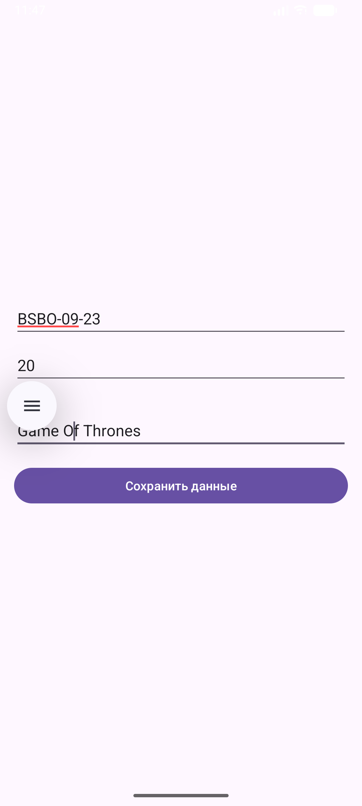
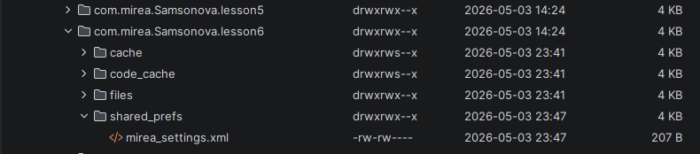
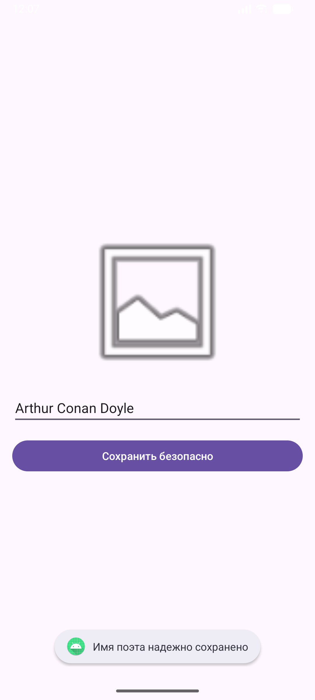
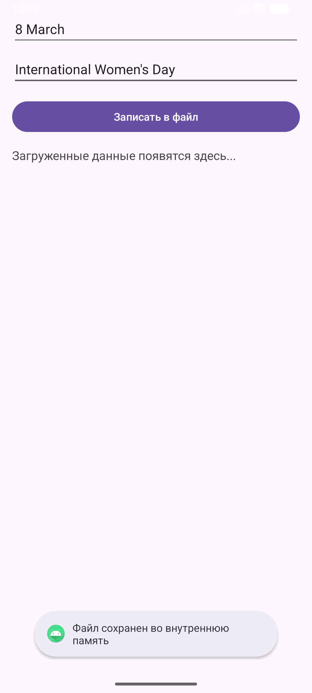
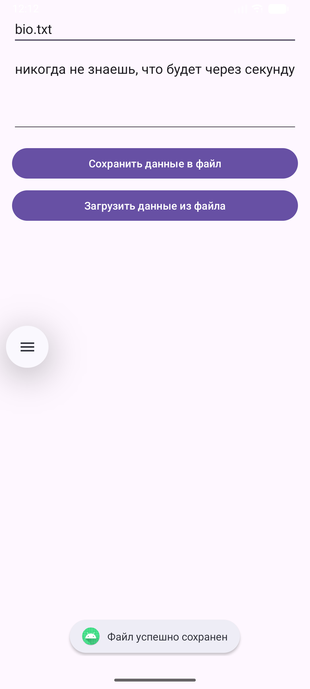
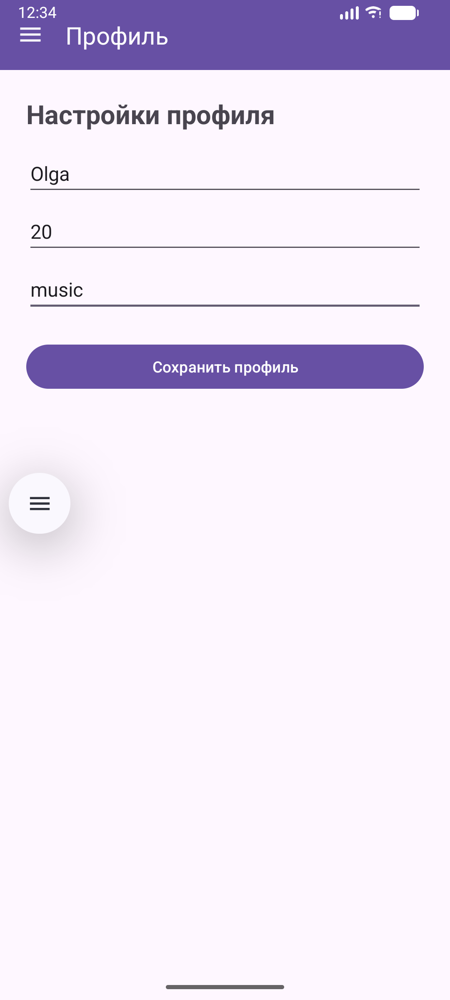
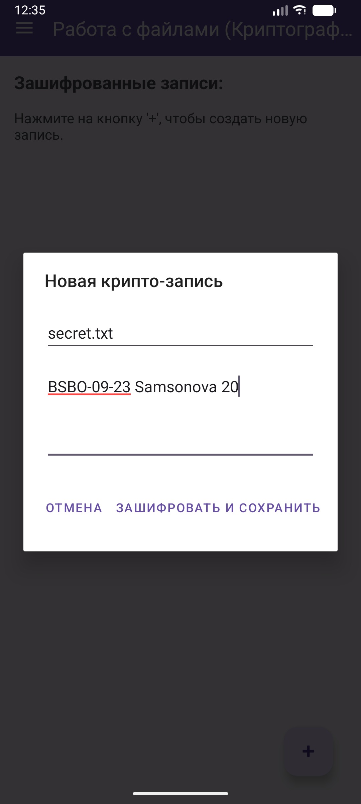
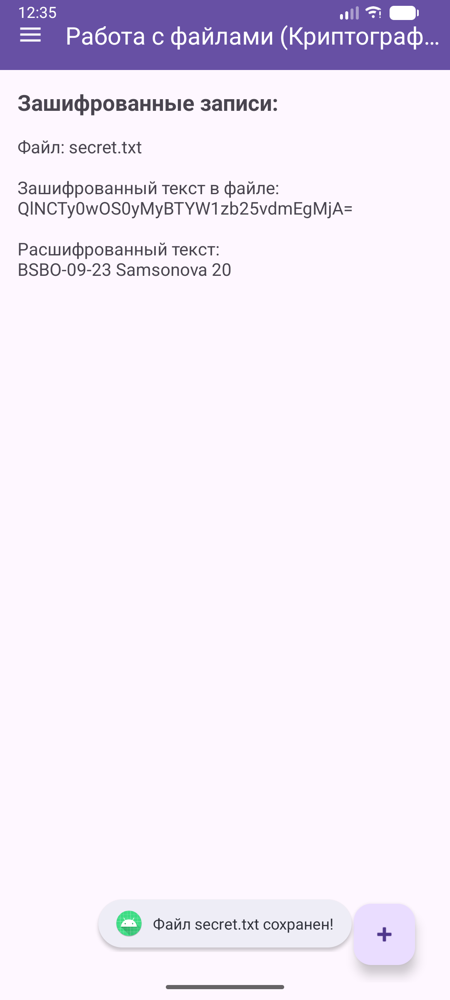

# Отчет по практической работе №6

**Выполнил:** Студент группы БСБО-09-23 **ФИО:** Самсонова Ольга Павловна **Дисциплина:** Разработка мобильных приложений

---

## 1. Цель работы

Целью данной работы является изучение и практическое применение различных механизмов локального хранения данных в операционной системе Android. В ходе работы необходимо освоить сохранение простых пар «ключ-значение» с использованием `SharedPreferences`, изучить методы криптографической защиты локальных данных с помощью библиотеки `Jetpack Security` (`EncryptedSharedPreferences`). Особое внимание уделяется работе с файловой системой: записи и чтению файлов во внутреннем (Internal Storage) и внешнем (External Storage) хранилищах с учетом современной системы разрешений. Также ставится задача по изучению архитектурного компонента `Room` для работы с реляционными базами данных SQLite на основе ORM-подхода. Итоговой задачей является интеграция изученных методов хранения в проект `MireaProject`.

---

## 2. Архитектура проекта

Проект разделен на отдельные модули, каждый из которых демонстрирует работу с конкретным типом хранилища:

1. **app (Lesson6)** — базовый модуль. Демонстрирует работу с `SharedPreferences` для сохранения простых типов данных (номер группы, списка и название фильма).
2. **securesharedpreferences** — модуль для изучения безопасного хранения данных. Использует алгоритмы AES256 для шифрования ключей и значений файла настроек.
3. **internalfilestorage** — работа с внутренней памятью приложения. Сохранение текстовых файлов, недоступных для других приложений ОС.
4. **notebook** — работа с внешним хранилищем (External Storage). Создание публичных файлов в директории `Documents` с предварительным запросом разрешений у пользователя.
5. **employeedb** — модуль для работы с базой данных на основе библиотеки `Room`. Реализует архитектуру `Entity`, `DAO` и `Database` для хранения информации о супер-героях.
6. **MireaProject** — интеграция изученных технологий в итоговый проект на базе **Navigation Drawer**. Включает реализацию контрольного задания: сохранение профиля пользователя и создание зашифрованных файловых записей через диалоговые окна.

---

## 3. Ход работы

### 3.1. Модуль app (Lesson6) — Работа со SharedPreferences

На первом этапе был изучен механизм хранения легковесных данных. Для получения экземпляра файла настроек использовался метод `getSharedPreferences()` с модификатором доступа `Context.MODE_PRIVATE`. 

Для записи данных вызывался метод `edit()`, возвращающий объект `SharedPreferences.Editor`. В него помещались данные из полей ввода (`putString`, `putInt`), после чего изменения асинхронно применялись методом `apply()`. Созданный XML-файл был успешно найден через инструмент **Device File Explorer** по пути `/data/data/.../shared_prefs/` и сохранен в директорию `raw` проекта.

**Рисунок 1: Главный экран модуля Lesson6 и сохраненные данные.**


**Рисунок 2: Скриншот файла mirea_settings.xml из Device File Explorer.**


**Листинг** `MainActivity.java`:

```java
package com.mirea.Samsonova.lesson6;

import android.content.Context;
import android.content.SharedPreferences;
import android.os.Bundle;
import android.view.View;
import android.widget.Toast;

import androidx.appcompat.app.AppCompatActivity;

import com.mirea.Samsonova.lesson6.databinding.ActivityMainBinding;

public class MainActivity extends AppCompatActivity {

    private ActivityMainBinding binding;
    private SharedPreferences sharedPref;

    @Override
    protected void onCreate(Bundle savedInstanceState) {
        super.onCreate(savedInstanceState);
        binding = ActivityMainBinding.inflate(getLayoutInflater());
        setContentView(binding.getRoot());

        sharedPref = getSharedPreferences("mirea_settings", Context.MODE_PRIVATE);

        binding.editGroup.setText(sharedPref.getString("GROUP", ""));
        binding.editNumber.setText(String.valueOf(sharedPref.getInt("NUMBER", 0)));
        binding.editMovie.setText(sharedPref.getString("MOVIE", ""));

        binding.btnSave.setOnClickListener(new View.OnClickListener() {
            @Override
            public void onClick(View v) {
                SharedPreferences.Editor editor = sharedPref.edit();
                editor.putString("GROUP", binding.editGroup.getText().toString());

                String numberStr = binding.editNumber.getText().toString();
                if (!numberStr.isEmpty()) {
                    editor.putInt("NUMBER", Integer.parseInt(numberStr));
                }

                editor.putString("MOVIE", binding.editMovie.getText().toString());
                editor.apply();

                Toast.makeText(MainActivity.this, "Данные сохранены", Toast.LENGTH_SHORT).show();
            }
        });
    }
}
```

**Листинг** `activity_main.xml`:

```java
<?xml version="1.0" encoding="utf-8"?>
<LinearLayout xmlns:android="http://schemas.android.com/apk/res/android"
    android:layout_width="match_parent"
    android:layout_height="match_parent"
    android:orientation="vertical"
    android:padding="16dp"
    android:gravity="center">

    <EditText
        android:id="@+id/editGroup"
        android:layout_width="match_parent"
        android:layout_height="wrap_content"
        android:hint="Номер группы (например, БСБО-09-23)" />

    <EditText
        android:id="@+id/editNumber"
        android:layout_width="match_parent"
        android:layout_height="wrap_content"
        android:hint="Номер по списку"
        android:inputType="number"
        android:layout_marginTop="8dp"/>

    <EditText
        android:id="@+id/editMovie"
        android:layout_width="match_parent"
        android:layout_height="wrap_content"
        android:hint="Любимый фильм/сериал"
        android:layout_marginTop="8dp"/>

    <Button
        android:id="@+id/btnSave"
        android:layout_width="match_parent"
        android:layout_height="wrap_content"
        android:text="Сохранить данные"
        android:layout_marginTop="16dp"/>

</LinearLayout>
```

---

### 3.2. Модуль SecureSharedPreferences — Шифрование настроек

Для повышения безопасности хранимых данных (имя любимого поэта) была подключена библиотека `androidx.security:security-crypto`. Был сгенерирован мастер-ключ с помощью класса `MasterKeys` и алгоритма `AES256_GCM_SPEC`.

Вместо стандартного класса использовался `EncryptedSharedPreferences.create()`. Ключи шифровались с использованием AES256-SIV-CMAC, а значения — с помощью AES256-GCM. Процесс чтения и записи остался идентичным стандартному подходу, однако физический XML-файл на устройстве теперь содержит нечитаемый зашифрованный текст.

**Рисунок 3: Интерфейс модуля SecureSharedPreferences. Сохранение имени поэта**


**Листинг** `build.gradle.kts` (добавление зависимости):

```java
plugins {
    alias(libs.plugins.android.application)
}

android {
    namespace = "com.mirea.Samsonova.securesharedpreferences"
    compileSdk {
        version = release(36) {
            minorApiLevel = 1
        }
    }

    defaultConfig {
        applicationId = "com.mirea.Samsonova.securesharedpreferences"
        minSdk = 26
        targetSdk = 36
        versionCode = 1
        versionName = "1.0"

        testInstrumentationRunner = "androidx.test.runner.AndroidJUnitRunner"
    }

    buildTypes {
        release {
            isMinifyEnabled = false
            proguardFiles(
                getDefaultProguardFile("proguard-android-optimize.txt"),
                "proguard-rules.pro"
            )
        }
    }
    compileOptions {
        sourceCompatibility = JavaVersion.VERSION_11
        targetCompatibility = JavaVersion.VERSION_11
    }

    buildFeatures {
        viewBinding = true
    }
}

dependencies {
    implementation("androidx.security:security-crypto:1.1.0-alpha06")
    implementation(libs.appcompat)
    implementation(libs.material)
    implementation(libs.activity)
    implementation(libs.constraintlayout)
    testImplementation(libs.junit)
    androidTestImplementation(libs.ext.junit)
    androidTestImplementation(libs.espresso.core)
}
```

**Листинг** `MainActivity.java`:

```java
package com.mirea.Samsonova.securesharedpreferences;

import android.content.SharedPreferences;
import android.os.Bundle;
import android.widget.Toast;

import androidx.appcompat.app.AppCompatActivity;
import androidx.security.crypto.EncryptedSharedPreferences;
import androidx.security.crypto.MasterKeys;

import java.io.IOException;
import java.security.GeneralSecurityException;

import com.mirea.Samsonova.securesharedpreferences.databinding.ActivityMainBinding;

public class MainActivity extends AppCompatActivity {

    private ActivityMainBinding binding;
    private SharedPreferences secureSharedPreferences;

    @Override
    protected void onCreate(Bundle savedInstanceState) {
        super.onCreate(savedInstanceState);
        binding = ActivityMainBinding.inflate(getLayoutInflater());
        setContentView(binding.getRoot());

        try {
            String mainKeyAlias = MasterKeys.getOrCreate(MasterKeys.AES256_GCM_SPEC);
            secureSharedPreferences = EncryptedSharedPreferences.create(
                    "secret_shared_prefs",
                    mainKeyAlias,
                    getBaseContext(),
                    EncryptedSharedPreferences.PrefKeyEncryptionScheme.AES256_SIV,
                    EncryptedSharedPreferences.PrefValueEncryptionScheme.AES256_GCM
            );

            String savedPoet = secureSharedPreferences.getString("POET_NAME", "");
            binding.editPoetName.setText(savedPoet);

        } catch (GeneralSecurityException | IOException e) {
            throw new RuntimeException(e);
        }

        binding.btnSaveSecure.setOnClickListener(v -> {
            String poetName = binding.editPoetName.getText().toString();
            secureSharedPreferences.edit().putString("POET_NAME", poetName).apply();
            Toast.makeText(this, "Имя поэта надежно сохранено", Toast.LENGTH_SHORT).show();
        });
    }
}
```

**Листинг** `activity_main.xml`:

```java
<?xml version="1.0" encoding="utf-8"?>
<LinearLayout xmlns:android="http://schemas.android.com/apk/res/android"
    android:layout_width="match_parent"
    android:layout_height="match_parent"
    android:orientation="vertical"
    android:padding="16dp"
    android:gravity="center">

    <ImageView
        android:id="@+id/imgPoet"
        android:layout_width="200dp"
        android:layout_height="200dp"
        android:src="@android:drawable/ic_menu_gallery"
        android:layout_marginBottom="16dp"/>

    <EditText
        android:id="@+id/editPoetName"
        android:layout_width="match_parent"
        android:layout_height="wrap_content"
        android:hint="Имя любимого поэта" />

    <Button
        android:id="@+id/btnSaveSecure"
        android:layout_width="match_parent"
        android:layout_height="wrap_content"
        android:text="Сохранить безопасно"
        android:layout_marginTop="16dp"/>

</LinearLayout>
```

---

### 3.3. Модуль InternalFileStorage — Внутреннее хранилище файлов

В данном модуле реализовано сохранение памятной даты истории России в приватную директорию приложения. Запись осуществлялась через поток `FileOutputStream`, получаемый методом `openFileOutput()` с режимом `MODE_PRIVATE`. 

Чтение файла реализовано через `FileInputStream` и метод `openFileInput()`. В соответствии с рекомендациями по асинхронному программированию, загрузка данных из файла и их вывод на экран были вынесены в отдельный поток (`Thread`) с использованием метода `post()` для обновления UI-компонента.

**Рисунок 4: Запись и чтение файла во внутреннем хранилище.**


**Листинг** `MainActivity.java`:

```java
package com.mirea.Samsonova.internalfilestorage;

import android.content.Context;
import android.os.Bundle;
import android.util.Log;
import android.widget.Toast;

import androidx.appcompat.app.AppCompatActivity;

import java.io.FileInputStream;
import java.io.FileOutputStream;
import java.io.IOException;

import com.mirea.Samsonova.internalfilestorage.databinding.ActivityMainBinding;

public class MainActivity extends AppCompatActivity {

    private ActivityMainBinding binding;
    private static final String LOG_TAG = MainActivity.class.getSimpleName();
    private String fileName = "history_date.txt";

    @Override
    protected void onCreate(Bundle savedInstanceState) {
        super.onCreate(savedInstanceState);
        binding = ActivityMainBinding.inflate(getLayoutInflater());
        setContentView(binding.getRoot());

        new Thread(new Runnable() {
            public void run() {
                try {
                    Thread.sleep(1000);
                } catch (InterruptedException e) {
                    e.printStackTrace();
                }
                binding.tvLoadedData.post(new Runnable() {
                    public void run() {
                        String loadedText = getTextFromFile();
                        if (loadedText != null && !loadedText.isEmpty()) {
                            binding.tvLoadedData.setText(loadedText);
                        }
                    }
                });
            }
        }).start();

        binding.btnSaveInternal.setOnClickListener(v -> {
            String date = binding.editDate.getText().toString();
            String desc = binding.editDesc.getText().toString();
            String fullText = date + " - " + desc;

            FileOutputStream outputStream;
            try {
                outputStream = openFileOutput(fileName, Context.MODE_PRIVATE);
                outputStream.write(fullText.getBytes());
                outputStream.close();
                Toast.makeText(this, "Файл сохранен во внутреннюю память", Toast.LENGTH_SHORT).show();
            } catch (Exception e) {
                e.printStackTrace();
            }
        });
    }

    public String getTextFromFile() {
        FileInputStream fin = null;
        try {
            fin = openFileInput(fileName);
            byte[] bytes = new byte[fin.available()];
            fin.read(bytes);
            String text = new String(bytes);
            Log.d(LOG_TAG, text);
            return text;
        } catch (IOException ex) {
            Toast.makeText(this, ex.getMessage(), Toast.LENGTH_SHORT).show();
        } finally {
            try {
                if (fin != null) fin.close();
            } catch (IOException ex) {
                Toast.makeText(this, ex.getMessage(), Toast.LENGTH_SHORT).show();
            }
        }
        return null;
    }
}
```

**Листинг** `activity_main.xml`:

```java
<?xml version="1.0" encoding="utf-8"?>
<LinearLayout xmlns:android="http://schemas.android.com/apk/res/android"
    android:layout_width="match_parent"
    android:layout_height="match_parent"
    android:orientation="vertical"
    android:padding="16dp">

    <EditText
        android:id="@+id/editDate"
        android:layout_width="match_parent"
        android:layout_height="wrap_content"
        android:hint="Памятная дата (например, 12 апреля 1961)" />

    <EditText
        android:id="@+id/editDesc"
        android:layout_width="match_parent"
        android:layout_height="wrap_content"
        android:hint="Описание события"
        android:layout_marginTop="8dp"/>

    <Button
        android:id="@+id/btnSaveInternal"
        android:layout_width="match_parent"
        android:layout_height="wrap_content"
        android:text="Записать в файл"
        android:layout_marginTop="16dp"/>

    <TextView
        android:id="@+id/tvLoadedData"
        android:layout_width="match_parent"
        android:layout_height="wrap_content"
        android:text="Загруженные данные появятся здесь..."
        android:layout_marginTop="16dp"
        android:textSize="16sp"/>

</LinearLayout>
```

---

### 3.4. Модуль Notebook — Внешнее хранилище (External Storage)

Модуль «Блокнот» демонстрирует работу с публичными директориями ОС Android. Перед выполнением операций записи и чтения происходит программный запрос разрешений `WRITE_EXTERNAL_STORAGE` и `READ_EXTERNAL_STORAGE`.

Также реализованы методы `isExternalStorageWritable()` и `isExternalStorageReadable()` для проверки состояния монтирования внешнего накопителя (`Environment.MEDIA_MOUNTED`). Файлы сохраняются в общую папку `Environment.DIRECTORY_DOCUMENTS`. Для работы с потоками использовались классы-обертки `InputStreamReader` и `OutputStreamWriter`.

**Рисунок 5: Сохранение файла в публичную директорию.**


**Листинг** `AndroidManifest.xml` (разрешения):

```xml
<uses-permission android:name="android.permission.WRITE_EXTERNAL_STORAGE"
        tools:ignore="ScopedStorage" />
<uses-permission android:name="android.permission.READ_EXTERNAL_STORAGE" />
```

**Листинг** `MainActivity.java`:

```java
package com.mirea.Samsonova.notebook;

import android.Manifest;
import android.content.pm.PackageManager;
import android.os.Bundle;
import android.os.Environment;
import android.util.Log;
import android.widget.Toast;

import androidx.appcompat.app.AppCompatActivity;
import androidx.core.app.ActivityCompat;
import androidx.core.content.ContextCompat;

import java.io.BufferedReader;
import java.io.File;
import java.io.FileInputStream;
import java.io.FileOutputStream;
import java.io.InputStreamReader;
import java.io.OutputStreamWriter;
import java.nio.charset.StandardCharsets;
import java.util.ArrayList;
import java.util.List;

import com.mirea.Samsonova.notebook.databinding.ActivityMainBinding;

public class MainActivity extends AppCompatActivity {

    private ActivityMainBinding binding;
    private static final int REQUEST_CODE_PERMISSION = 100;

    @Override
    protected void onCreate(Bundle savedInstanceState) {
        super.onCreate(savedInstanceState);
        binding = ActivityMainBinding.inflate(getLayoutInflater());
        setContentView(binding.getRoot());

        if (ContextCompat.checkSelfPermission(this, Manifest.permission.WRITE_EXTERNAL_STORAGE) != PackageManager.PERMISSION_GRANTED) {
            ActivityCompat.requestPermissions(this, new String[]{Manifest.permission.WRITE_EXTERNAL_STORAGE, Manifest.permission.READ_EXTERNAL_STORAGE}, REQUEST_CODE_PERMISSION);
        }

        binding.btnSaveExt.setOnClickListener(v -> writeFileToExternalStorage());
        binding.btnLoadExt.setOnClickListener(v -> readFileFromExternalStorage());
    }

    public void writeFileToExternalStorage() {
        if (!isExternalStorageWritable()) return;

        String fileName = binding.editFileName.getText().toString();
        String quote = binding.editQuote.getText().toString();

        if(fileName.isEmpty()) {
            Toast.makeText(this, "Введите имя файла", Toast.LENGTH_SHORT).show();
            return;
        }

        File path = Environment.getExternalStoragePublicDirectory(Environment.DIRECTORY_DOCUMENTS);
        File file = new File(path, fileName);
        try {
            FileOutputStream fileOutputStream = new FileOutputStream(file.getAbsoluteFile());
            OutputStreamWriter output = new OutputStreamWriter(fileOutputStream);
            output.write(quote);
            output.close();
            Toast.makeText(this, "Файл успешно сохранен", Toast.LENGTH_SHORT).show();
        } catch (Exception e) {
            Log.w("ExternalStorage", "Error writing " + file, e);
        }
    }

    public void readFileFromExternalStorage() {
        if (!isExternalStorageReadable()) return;

        String fileName = binding.editFileName.getText().toString();
        if(fileName.isEmpty()) {
            Toast.makeText(this, "Введите имя файла для загрузки", Toast.LENGTH_SHORT).show();
            return;
        }

        File path = Environment.getExternalStoragePublicDirectory(Environment.DIRECTORY_DOCUMENTS);
        File file = new File(path, fileName);
        try {
            FileInputStream fileInputStream = new FileInputStream(file.getAbsoluteFile());
            InputStreamReader inputStreamReader = new InputStreamReader(fileInputStream, StandardCharsets.UTF_8);
            List<String> lines = new ArrayList<>();
            BufferedReader reader = new BufferedReader(inputStreamReader);
            String line = reader.readLine();
            while (line != null) {
                lines.add(line);
                line = reader.readLine();
            }

            StringBuilder sb = new StringBuilder();
            for(String s : lines) { sb.append(s).append("\n"); }
            binding.editQuote.setText(sb.toString().trim());

            Log.w("ExternalStorage", String.format("Read from file %s successful", lines.toString()));
        } catch (Exception e) {
            Log.w("ExternalStorage", String.format("Read from file %s failed", e.getMessage()));
            Toast.makeText(this, "Ошибка чтения файла", Toast.LENGTH_SHORT).show();
        }
    }

    public boolean isExternalStorageWritable() {
        String state = Environment.getExternalStorageState();
        return Environment.MEDIA_MOUNTED.equals(state);
    }

    public boolean isExternalStorageReadable() {
        String state = Environment.getExternalStorageState();
        return Environment.MEDIA_MOUNTED.equals(state) || Environment.MEDIA_MOUNTED_READ_ONLY.equals(state);
    }
}
```

**Листинг** `activity_main.xml`:

```java
<?xml version="1.0" encoding="utf-8"?>
<LinearLayout xmlns:android="http://schemas.android.com/apk/res/android"
    android:layout_width="match_parent"
    android:layout_height="match_parent"
    android:orientation="vertical"
    android:padding="16dp">

    <EditText
        android:id="@+id/editFileName"
        android:layout_width="match_parent"
        android:layout_height="wrap_content"
        android:hint="Имя файла (например: quote.txt)" />

    <EditText
        android:id="@+id/editQuote"
        android:layout_width="match_parent"
        android:layout_height="wrap_content"
        android:hint="Цитата"
        android:lines="4"
        android:gravity="top"
        android:layout_marginTop="8dp"/>

    <Button
        android:id="@+id/btnSaveExt"
        android:layout_width="match_parent"
        android:layout_height="wrap_content"
        android:text="Сохранить данные в файл"
        android:layout_marginTop="16dp"/>

    <Button
        android:id="@+id/btnLoadExt"
        android:layout_width="match_parent"
        android:layout_height="wrap_content"
        android:text="Загрузить данные из файла"
        android:layout_marginTop="8dp"/>

</LinearLayout>
```

---

### 3.5. Модуль EmployeeDB — База данных Room

Для работы с SQLite была использована библиотека `Room`. Архитектура модуля состоит из трех компонентов:
1. **Entity** — класс `Superhero`, размеченный аннотациями `@Entity` и `@PrimaryKey(autoGenerate = true)`.
2. **DAO** — интерфейс `SuperheroDao` с SQL-запросами (`@Query`, `@Insert`, `@Update`).
3. **Database** — абстрактный класс `AppDatabase`.

Инициализация базы данных реализована в классе-наследнике `Application` (паттерн Singleton), что гарантирует создание лишь одного экземпляра БД на всё приложение во время `onCreate()`. В `MainActivity` реализован полный цикл CRUD: создание героя, запись в БД, чтение, изменение поля и обновление записи.

**Рисунок 6: База данных Room на экране.**


**Листинг** `build.gradle.kts` (зависимости Room):

```kotlin
dependencies {
    implementation(libs.appcompat)
    implementation(libs.material)
    implementation(libs.activity)
    implementation(libs.constraintlayout)
    testImplementation(libs.junit)
    androidTestImplementation(libs.ext.junit)
    androidTestImplementation(libs.espresso.core)

    val room_version = "2.6.1"

    implementation("androidx.room:room-runtime:$room_version")
    annotationProcessor("androidx.room:room-compiler:$room_version")
}
```

**Листинг** `Superhero.java` (Entity):

```java
package com.mirea.Samsonova.employeedb;

import androidx.room.Entity;
import androidx.room.PrimaryKey;

@Entity
public class Superhero {
    @PrimaryKey(autoGenerate = true)
    public long id;
    public String name;
    public String superpower;
}
```

**Листинг** `SuperheroDao.java` (DAO):

```java
code
```

**Листинг** `AppDatabase.java`:

```java
package com.mirea.Samsonova.employeedb;

import androidx.room.Dao;
import androidx.room.Delete;
import androidx.room.Insert;
import androidx.room.Query;
import androidx.room.Update;

import java.util.List;

@Dao
public interface SuperheroDao {
    @Query("SELECT * FROM superhero")
    List<Superhero> getAll();

    @Query("SELECT * FROM superhero WHERE id = :id")
    Superhero getById(long id);

    @Insert
    void insert(Superhero hero);

    @Update
    void update(Superhero hero);

    @Delete
    void delete(Superhero hero);
}
```

**Листинг** `App.java` (Application):

```java
package com.mirea.Samsonova.employeedb;

import android.app.Application;
import androidx.room.Room;

public class App extends Application {
    public static App instance;
    private AppDatabase database;

    @Override
    public void onCreate() {
        super.onCreate();
        instance = this;
        database = Room.databaseBuilder(this, AppDatabase.class, "superheroes_database")
                .allowMainThreadQueries()
                .build();
    }

    public static App getInstance() {
        return instance;
    }

    public AppDatabase getDatabase() {
        return database;
    }
}
```

**Листинг** `AndroidManifest.xml` (Регистрация App):

```xml
<?xml version="1.0" encoding="utf-8"?>
<manifest xmlns:android="http://schemas.android.com/apk/res/android">

    <application
        android:name=".App"
        android:allowBackup="true"
        android:icon="@mipmap/ic_launcher"
        android:label="@string/app_name"
        android:roundIcon="@mipmap/ic_launcher_round"
        android:supportsRtl="true"
        android:theme="@style/Theme.Lesson6">
        <activity
            android:name=".MainActivity"
            android:exported="true">
            <intent-filter>
                <action android:name="android.intent.action.MAIN" />

                <category android:name="android.intent.category.LAUNCHER" />
            </intent-filter>
        </activity>
    </application>

</manifest>
```

**Листинг** `MainActivity.java`:

```java
package com.mirea.Samsonova.employeedb;

import android.os.Bundle;
import android.util.Log;

import androidx.appcompat.app.AppCompatActivity;

import java.util.List;

import com.mirea.Samsonova.employeedb.databinding.ActivityMainBinding;

public class MainActivity extends AppCompatActivity {

    private ActivityMainBinding binding;
    private static final String TAG = "SUPERHERO_DB";

    @Override
    protected void onCreate(Bundle savedInstanceState) {
        super.onCreate(savedInstanceState);
        binding = ActivityMainBinding.inflate(getLayoutInflater());
        setContentView(binding.getRoot());

        AppDatabase db = App.getInstance().getDatabase();
        SuperheroDao superheroDao = db.superheroDao();

        Superhero hero = new Superhero();
        hero.name = "Spider-Man";
        hero.superpower = "Паутина и чутье";

        superheroDao.insert(hero);

        List<Superhero> heroes = superheroDao.getAll();

        Superhero savedHero = heroes.get(heroes.size() - 1);

        savedHero.superpower = "Усиленная паутина";
        superheroDao.update(savedHero);

        Log.d(TAG, savedHero.name + " - " + savedHero.superpower);
        binding.tvDbLog.setText("Герой: " + savedHero.name + "\nСила: " + savedHero.superpower);
    }
}
```

**Листинг** `activity_main.xml`:

```java
<?xml version="1.0" encoding="utf-8"?>
<LinearLayout xmlns:android="http://schemas.android.com/apk/res/android"
    android:layout_width="match_parent"
    android:layout_height="match_parent"
    android:orientation="vertical"
    android:padding="16dp"
    android:gravity="center">

    <TextView
        android:id="@+id/tvDbLog"
        android:layout_width="match_parent"
        android:layout_height="wrap_content"
        android:text="Лог базы данных..."
        android:textSize="18sp"/>

</LinearLayout>
```

---

### 3.6. Контрольное задание — Проект MireaProject

В рамках контрольного задания в проект `MireaProject` были добавлены два новых фрагмента с использованием архитектуры Navigation Drawer.

**1. Фрагмент «Профиль» (ProfileFragment):** 
Реализует сохранение персональных данных пользователя (Имя, Возраст, Хобби) с помощью `SharedPreferences`. При повторном открытии фрагмента данные автоматически загружаются из памяти устройства.

**2. Фрагмент «Работа с файлами» (FilesFragment):**
Реализует «творческую» задачу — криптографический блокнот. Интерфейс оснащен кнопкой `FloatingActionButton`. При нажатии вызывается `AlertDialog` с кастомной разметкой для ввода имени файла и секретного текста. При сохранении текст кодируется алгоритмом `Base64` и записывается во внутреннее хранилище. Для наглядности фрагмент автоматически считывает файл и выводит на экран как зашифрованный исходник, так и декодированный результат.

**Рисунок 7: Экран Профиля пользователя.**


**Рисунок 8: Диалоговое окно добавления крипто-записи.**


**Рисунок 9: Результат шифрования и расшифровки файла.**



**Листинг** `strings.xml`:

```xml
<resources>
    <string name="app_name">MireaProject</string>
    <string name="menu_home">Главная</string>
    <string name="menu_data">Отрасль</string>
    <string name="menu_webview">WebView</string>
    <string name="navigation_drawer_open">Открыть навигационное меню</string>
    <string name="navigation_drawer_close">Закрыть навигационное меню</string>
    <string name="menu_sensor">Компас (Датчик)</string>
    <string name="menu_camera">Аватар (Камера)</string>
    <string name="menu_audio">Аудиозаметка</string>
    <string name="menu_profile">Профиль</string>
    <string name="menu_files">Работа с файлами (Криптография)</string>
    <!-- TODO: Remove or change this placeholder text -->
    <string name="hello_blank_fragment">Hello blank fragment</string>
</resources>
```

**Листинг** `activity_main_drawer.xml`:

```xml
<?xml version="1.0" encoding="utf-8"?>
<menu xmlns:android="http://schemas.android.com/apk/res/android">

    <group android:checkableBehavior="single">

        <item
            android:id="@+id/nav_home"
            android:icon="@android:drawable/ic_menu_view"
            android:title="@string/menu_home" />

        <item
            android:id="@+id/nav_data"
            android:icon="@android:drawable/ic_menu_info_details"
            android:title="@string/menu_data" />

        <item
            android:id="@+id/nav_webview"
            android:icon="@android:drawable/ic_menu_search"
            android:title="@string/menu_webview" />

        <item
            android:id="@+id/nav_worker"
            android:icon="@android:drawable/ic_menu_manage"
            android:title="Фоновая задача" />

        <item
            android:id="@+id/nav_sensor"
            android:icon="@android:drawable/ic_menu_compass"
            android:title="@string/menu_sensor" />

        <item
            android:id="@+id/nav_camera"
            android:icon="@android:drawable/ic_menu_camera"
            android:title="@string/menu_camera" />

        <item
            android:id="@+id/nav_audio"
            android:icon="@android:drawable/ic_btn_speak_now"
            android:title="@string/menu_audio" />

        <item
            android:id="@+id/nav_profile"
            android:icon="@android:drawable/ic_menu_myplaces"
            android:title="@string/menu_profile" />

        <item
            android:id="@+id/nav_files"
            android:icon="@android:drawable/ic_menu_save"
            android:title="@string/menu_files" />

    </group>
</menu>
```

**Листинг** `mobile_navigation.xml`:

```xml
<?xml version="1.0" encoding="utf-8"?>
<navigation xmlns:android="http://schemas.android.com/apk/res/android"
    xmlns:app="http://schemas.android.com/apk/res-auto"
    xmlns:tools="http://schemas.android.com/tools"
    android:id="@+id/mobile_navigation"
    app:startDestination="@id/nav_home">

    <fragment
        android:id="@+id/nav_home"
        android:name="com.mirea.Samsonova.mireaproject.ui.home.HomeFragment"
        android:label="@string/menu_home"
        tools:layout="@layout/fragment_home" />

    <fragment
        android:id="@+id/nav_data"
        android:name="com.mirea.Samsonova.mireaproject.ui.data.DataFragment"
        android:label="@string/menu_data"
        tools:layout="@layout/fragment_data" />

    <fragment
        android:id="@+id/nav_webview"
        android:name="com.mirea.Samsonova.mireaproject.ui.webview.WebViewFragment"
        android:label="@string/menu_webview"
        tools:layout="@layout/fragment_web_view" />

    <fragment
        android:id="@+id/nav_worker"
        android:name="com.mirea.Samsonova.mireaproject.ui.worker.WorkerFragment"
        android:label="Background Task"
        tools:layout="@layout/fragment_worker" />

    <fragment
        android:id="@+id/nav_sensor"
        android:name="com.mirea.Samsonova.mireaproject.ui.sensor.SensorFragment"
        android:label="@string/menu_sensor"
        tools:layout="@layout/fragment_sensor" />

    <fragment
        android:id="@+id/nav_camera"
        android:name="com.mirea.Samsonova.mireaproject.ui.camera.CameraFragment"
        android:label="@string/menu_camera"
        tools:layout="@layout/fragment_camera" />

    <fragment
        android:id="@+id/nav_audio"
        android:name="com.mirea.Samsonova.mireaproject.ui.audio.AudioFragment"
        android:label="@string/menu_audio"
        tools:layout="@layout/fragment_audio" />

    <fragment
        android:id="@+id/nav_profile"
        android:name="com.mirea.Samsonova.mireaproject.ui.profile.ProfileFragment"
        android:label="@string/menu_profile"
        tools:layout="@layout/fragment_profile" />

    <fragment
        android:id="@+id/nav_files"
        android:name="com.mirea.Samsonova.mireaproject.ui.files.FilesFragment"
        android:label="@string/menu_files"
        tools:layout="@layout/fragment_files" />

</navigation>
```

**Листинг** `MainActivity.java` (MireaProject):

```java
package com.mirea.Samsonova.mireaproject;

import android.os.Bundle;
import android.view.Menu;

import androidx.appcompat.app.ActionBarDrawerToggle;
import androidx.appcompat.app.AppCompatActivity;
import androidx.appcompat.widget.Toolbar;
import androidx.drawerlayout.widget.DrawerLayout;
import androidx.navigation.NavController;
import androidx.navigation.fragment.NavHostFragment;
import androidx.navigation.ui.AppBarConfiguration;
import androidx.navigation.ui.NavigationUI;

import com.google.android.material.navigation.NavigationView;

public class MainActivity extends AppCompatActivity {

    private AppBarConfiguration mAppBarConfiguration;
    private DrawerLayout drawerLayout;
    private NavigationView navigationView;
    private Toolbar toolbar;
    private NavController navController;

    @Override
    protected void onCreate(Bundle savedInstanceState) {
        super.onCreate(savedInstanceState);
        setContentView(R.layout.activity_main);

        toolbar = findViewById(R.id.toolbar);
        setSupportActionBar(toolbar);

        drawerLayout = findViewById(R.id.drawer_layout);
        navigationView = findViewById(R.id.nav_view);

        NavHostFragment navHostFragment =
                (NavHostFragment) getSupportFragmentManager()
                        .findFragmentById(R.id.nav_host_fragment_content_main);

        if (navHostFragment == null) {
            throw new IllegalStateException("NavHostFragment not found");
        }

        navController = navHostFragment.getNavController();

        mAppBarConfiguration = new AppBarConfiguration.Builder(
                R.id.nav_home,
                R.id.nav_data,
                R.id.nav_webview,
                R.id.nav_sensor,
                R.id.nav_camera,
                R.id.nav_audio,
                R.id.nav_profile,
                R.id.nav_files
        ).setOpenableLayout(drawerLayout).build();

        NavigationUI.setupActionBarWithNavController(this, navController, mAppBarConfiguration);
        NavigationUI.setupWithNavController(navigationView, navController);

        ActionBarDrawerToggle toggle = new ActionBarDrawerToggle(
                this,
                drawerLayout,
                toolbar,
                R.string.navigation_drawer_open,
                R.string.navigation_drawer_close
        );
        drawerLayout.addDrawerListener(toggle);
        toggle.syncState();
    }

    @Override
    public boolean onCreateOptionsMenu(Menu menu) {
        getMenuInflater().inflate(R.menu.main, menu);
        return true;
    }

    @Override
    public boolean onSupportNavigateUp() {
        return NavigationUI.navigateUp(navController, mAppBarConfiguration)
                || super.onSupportNavigateUp();
    }
}
```

**Листинг** `ProfileFragment.java`:

```java
package com.mirea.Samsonova.mireaproject.ui.profile;

import android.content.Context;
import android.content.SharedPreferences;
import android.os.Bundle;
import android.view.LayoutInflater;
import android.view.View;
import android.view.ViewGroup;
import android.widget.Button;
import android.widget.EditText;
import android.widget.Toast;

import androidx.annotation.NonNull;
import androidx.fragment.app.Fragment;

import com.mirea.Samsonova.mireaproject.R;

public class ProfileFragment extends Fragment {

    private EditText editProfileName, editProfileAge, editProfileHobby;
    private SharedPreferences sharedPreferences;

    @Override
    public View onCreateView(@NonNull LayoutInflater inflater, ViewGroup container, Bundle savedInstanceState) {
        View root = inflater.inflate(R.layout.fragment_profile, container, false);

        editProfileName = root.findViewById(R.id.editProfileName);
        editProfileAge = root.findViewById(R.id.editProfileAge);
        editProfileHobby = root.findViewById(R.id.editProfileHobby);
        Button btnSaveProfile = root.findViewById(R.id.btnSaveProfile);

        sharedPreferences = requireActivity().getSharedPreferences("mirea_project_profile", Context.MODE_PRIVATE);

        editProfileName.setText(sharedPreferences.getString("NAME", ""));
        editProfileAge.setText(sharedPreferences.getString("AGE", ""));
        editProfileHobby.setText(sharedPreferences.getString("HOBBY", ""));

        btnSaveProfile.setOnClickListener(v -> {
            SharedPreferences.Editor editor = sharedPreferences.edit();
            editor.putString("NAME", editProfileName.getText().toString());
            editor.putString("AGE", editProfileAge.getText().toString());
            editor.putString("HOBBY", editProfileHobby.getText().toString());
            editor.apply();

            Toast.makeText(requireContext(), "Профиль сохранен!", Toast.LENGTH_SHORT).show();
        });

        return root;
    }
}
```

**Листинг** `fragment_profile.xml`:

```xml
<?xml version="1.0" encoding="utf-8"?>
<LinearLayout xmlns:android="http://schemas.android.com/apk/res/android"
    android:layout_width="match_parent"
    android:layout_height="match_parent"
    android:orientation="vertical"
    android:padding="24dp">

    <TextView
        android:layout_width="match_parent"
        android:layout_height="wrap_content"
        android:text="Настройки профиля"
        android:textSize="24sp"
        android:textStyle="bold"
        android:layout_marginBottom="16dp" />

    <EditText
        android:id="@+id/editProfileName"
        android:layout_width="match_parent"
        android:layout_height="wrap_content"
        android:hint="Имя пользователя" />

    <EditText
        android:id="@+id/editProfileAge"
        android:layout_width="match_parent"
        android:layout_height="wrap_content"
        android:hint="Возраст"
        android:inputType="number"
        android:layout_marginTop="8dp" />

    <EditText
        android:id="@+id/editProfileHobby"
        android:layout_width="match_parent"
        android:layout_height="wrap_content"
        android:hint="Любимое хобби"
        android:layout_marginTop="8dp" />

    <Button
        android:id="@+id/btnSaveProfile"
        android:layout_width="match_parent"
        android:layout_height="wrap_content"
        android:text="Сохранить профиль"
        android:layout_marginTop="24dp" />

</LinearLayout>
```

**Листинг** `FilesFragment.java`:

```java
package com.mirea.Samsonova.mireaproject.ui.files;

import android.app.AlertDialog;
import android.content.Context;
import android.os.Bundle;
import android.util.Base64;
import android.view.LayoutInflater;
import android.view.View;
import android.view.ViewGroup;
import android.widget.EditText;
import android.widget.TextView;
import android.widget.Toast;

import androidx.annotation.NonNull;
import androidx.fragment.app.Fragment;

import com.google.android.material.floatingactionbutton.FloatingActionButton;
import com.mirea.Samsonova.mireaproject.R;

import java.io.FileInputStream;
import java.io.FileOutputStream;

public class FilesFragment extends Fragment {

    private TextView tvDecryptedContent;

    @Override
    public View onCreateView(@NonNull LayoutInflater inflater, ViewGroup container, Bundle savedInstanceState) {
        View root = inflater.inflate(R.layout.fragment_files, container, false);

        tvDecryptedContent = root.findViewById(R.id.tvDecryptedContent);
        FloatingActionButton fabAddFile = root.findViewById(R.id.fabAddFile);

        fabAddFile.setOnClickListener(v -> showCreateFileDialog());

        return root;
    }

    private void showCreateFileDialog() {
        View dialogView = LayoutInflater.from(requireContext()).inflate(R.layout.dialog_new_file, null);
        EditText editFileName = dialogView.findViewById(R.id.dialogFileName);
        EditText editFileContent = dialogView.findViewById(R.id.dialogFileContent);

        new AlertDialog.Builder(requireContext())
                .setTitle("Новая крипто-запись")
                .setView(dialogView)
                .setPositiveButton("Зашифровать и сохранить", (dialog, which) -> {
                    String fileName = editFileName.getText().toString();
                    String content = editFileContent.getText().toString();

                    if (!fileName.isEmpty() && !content.isEmpty()) {
                        saveEncryptedFile(fileName, content);
                    } else {
                        Toast.makeText(requireContext(), "Заполните все поля", Toast.LENGTH_SHORT).show();
                    }
                })
                .setNegativeButton("Отмена", null)
                .show();
    }

    private void saveEncryptedFile(String fileName, String content) {
        try {
            String encryptedBase64 = Base64.encodeToString(content.getBytes(), Base64.DEFAULT);

            FileOutputStream outputStream = requireActivity().openFileOutput(fileName, Context.MODE_PRIVATE);
            outputStream.write(encryptedBase64.getBytes());
            outputStream.close();

            Toast.makeText(requireContext(), "Файл " + fileName + " сохранен!", Toast.LENGTH_SHORT).show();

            readAndDecryptFile(fileName);

        } catch (Exception e) {
            e.printStackTrace();
            Toast.makeText(requireContext(), "Ошибка при сохранении", Toast.LENGTH_SHORT).show();
        }
    }

    private void readAndDecryptFile(String fileName) {
        try {
            FileInputStream fin = requireActivity().openFileInput(fileName);
            byte[] bytes = new byte[fin.available()];
            fin.read(bytes);
            fin.close();

            String encryptedText = new String(bytes);

            byte[] decryptedBytes = Base64.decode(encryptedText, Base64.DEFAULT);
            String decryptedText = new String(decryptedBytes);

            tvDecryptedContent.setText("Файл: " + fileName + "\n\nЗашифрованный текст в файле:\n"
                    + encryptedText + "\nРасшифрованный текст:\n" + decryptedText);

        } catch (Exception e) {
            e.printStackTrace();
        }
    }
}
```

**Листинг** `fragment_files.xml`:

```xml
<?xml version="1.0" encoding="utf-8"?>
<androidx.constraintlayout.widget.ConstraintLayout
    xmlns:android="http://schemas.android.com/apk/res/android"
    xmlns:app="http://schemas.android.com/apk/res-auto"
    android:layout_width="match_parent"
    android:layout_height="match_parent"
    android:padding="16dp">

    <TextView
        android:id="@+id/tvFileTitle"
        android:layout_width="wrap_content"
        android:layout_height="wrap_content"
        android:text="Зашифрованные записи:"
        android:textSize="20sp"
        android:textStyle="bold"
        app:layout_constraintTop_toTopOf="parent"
        app:layout_constraintStart_toStartOf="parent"/>

    <TextView
        android:id="@+id/tvDecryptedContent"
        android:layout_width="match_parent"
        android:layout_height="0dp"
        android:text="Нажмите на кнопку '+', чтобы создать новую запись."
        android:layout_marginTop="16dp"
        android:textSize="16sp"
        app:layout_constraintTop_toBottomOf="@id/tvFileTitle"
        app:layout_constraintBottom_toBottomOf="parent"/>

    <com.google.android.material.floatingactionbutton.FloatingActionButton
        android:id="@+id/fabAddFile"
        android:layout_width="wrap_content"
        android:layout_height="wrap_content"
        android:layout_margin="16dp"
        android:src="@android:drawable/ic_input_add"
        app:layout_constraintBottom_toBottomOf="parent"
        app:layout_constraintEnd_toEndOf="parent" />

</androidx.constraintlayout.widget.ConstraintLayout>
```

**Листинг** `dialog_new_file.xml`:

```xml
<?xml version="1.0" encoding="utf-8"?>
<LinearLayout xmlns:android="http://schemas.android.com/apk/res/android"
    android:layout_width="match_parent"
    android:layout_height="wrap_content"
    android:orientation="vertical"
    android:padding="24dp">

    <EditText
        android:id="@+id/dialogFileName"
        android:layout_width="match_parent"
        android:layout_height="wrap_content"
        android:hint="Имя файла (например, secret.txt)" />

    <EditText
        android:id="@+id/dialogFileContent"
        android:layout_width="match_parent"
        android:layout_height="wrap_content"
        android:hint="Секретный текст"
        android:lines="4"
        android:gravity="top"
        android:layout_marginTop="16dp"/>

</LinearLayout>
```

---

## 4. Результаты работы

В ходе выполнения практической работы №6 были достигнуты следующие результаты:

1. Освоен механизм `SharedPreferences` для эффективного сохранения примитивных типов данных и настроек приложения. Успешно изучена структура директорий Android через `Device File Explorer`.
2. Реализовано криптографическое шифрование локальных данных с помощью библиотеки `Jetpack Security Crypto`, что позволяет защитить конфиденциальную информацию пользователя от извлечения.
3. Изучены классы пакета `java.io` и специфика работы с `Internal Storage` для обеспечения приватности файлов приложения.
4. Успешно реализован механизм взаимодействия с `External Storage` (директория Documents) с корректной обработкой Runtime-разрешений.
5. Освоен архитектурный компонент `Room` для типизированной и удобной работы с базами данных SQLite на основе аннотаций (`Entity`, `DAO`, `Database`).
6. В итоговый проект `MireaProject` интегрирован функционал настройки профиля пользователя и сложный алгоритм создания, Base64-шифрования и чтения файлов через диалоговые окна (AlertDialog) и Floating Action Button.

Работа выполнена в полном объеме, все программные модули функционируют корректно, соблюдены современные принципы архитектуры Android-приложений.